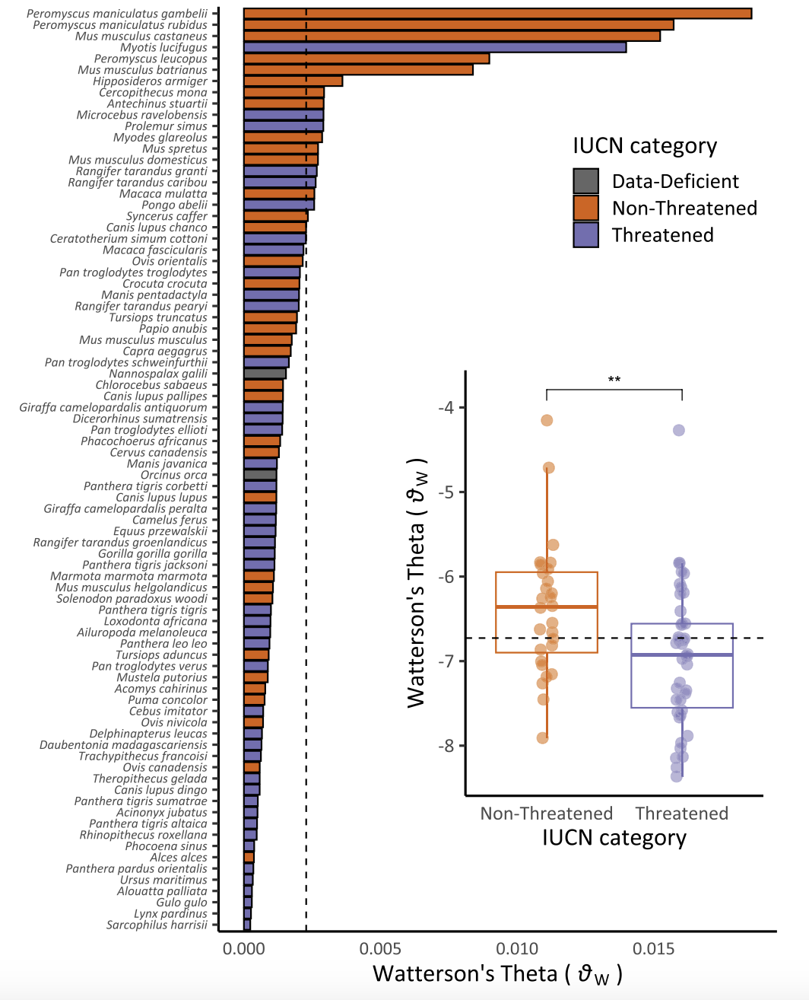

# The Coalescent

To conclude our unit on $N_e$, we will now briefly address how it is estimated with empirical data. A large number of methods exist, relying on data on the loss of heterozygosity in subsequent generations (discussed previously), the rate of decay in linkage disequilibrium, the loss of allelic diversity, and estimates of drift / mutation equilibrium (for long temporal time scales). Perhaps most useful is Watterson's estimator, which relies on a parameter $\theta$ ("theta"), defined as $\theta=4N_e\mu.$

$\theta$ is something known as the population mutation parameter, which gives us the expected number of segregating (=different) alleles in a population of a given size and given mutation rate. To understand this, recall that any two alleles in a single generation are identical by descent in the previous generation at probability $\frac{1}{2Ne}$. This observation is the basis of a body of work known as coalescent theory, which is concerned with finding the time to the most recent common ancestor ("MRCA") of a pair of alleles. We can expand the probability of IBD to get at the probability any two alleles *coalesce* in $t$ generations, which is simply the probability they *don't* coalesce in the previous generation multiplied by the probability of coalescence in the generation of interest:

$$
P_{coalesce}(t) = (1 - \frac{1}{2N_e})^{t-1}(\frac{1}{2N_e})
$$

This form should look familiar, as it can be approximated by the exponential distribution when $N_e$ is sufficiently large:

$$
P_{coalesce}(t) = \frac{1}{2N_e}e^{-\frac{t-1}{2N_e}}
$$

This is helped because the expected value (think weighted average) of the exponential distribution is $\frac{1}{\lambda}$, where $\lambda$ is the rate parameter of the distribution. In this case, that's $\frac{1}{2N_e}$, which means that the expected time to coalescence for any two alleles is $1 \div \frac{1}{2N_e} = 2N_e$ generations. The plot below shows the expected time to coalescence and probability of coalescence in each generation for populations with effective sizes $N_e=50$, $N_e=100$, and $N_e=500$:

```{r, warning=FALSE, message=FALSE}
library(ggplot2)
library(dplyr)

# define functions for different effective population sizes
coalesce_50 <- function(x){(1/(2*50))*exp(-(x-1)/(2*50))}
coalesce_100 <- function(x){(1/(2*100))*exp(-(x-1)/(2*100))}
coalesce_200 <- function(x){(1/(2*200))*exp(-(x-1)/(2*200))}

# create a data frame with values from all functions
x_vals <- seq(0, 500, by = 1)

labels <- c("Ne=50", "Ne=100", "Ne=200")
levels_ordered <- factor(labels, levels = labels)

# create function data frame
df <- data.frame(
  Generation = rep(x_vals, 3),
  Probability = c(coalesce_50(x_vals), coalesce_100(x_vals), coalesce_200(x_vals)),
  Function = factor(rep(labels, each = length(x_vals)), levels = labels)
)

# create expected values data frame
vline_df <- data.frame(
  Function = levels_ordered,
  xintercept = c(100, 200, 400)
)

# plot
ggplot(df, aes(x = Generation, y = Probability, color = Function)) +
  theme_classic() +
  xlim(c(0, 550)) +
  geom_line() +
  geom_vline(data = vline_df,
             aes(xintercept = xintercept, color = Function), 
             linetype = "dashed", show.legend = FALSE) +
  xlab("Generation") +
  ylab("P(Coalescence)") +
  scale_color_manual(
    values = c("Ne=50" = "dodgerblue", 
               "Ne=100" = "orange", 
               "Ne=200" = "darkgreen"),
    labels = c(
      expression(N[e] == 50),
      expression(N[e] == 100),
      expression(N[e] == 200)
    ),
    name = NULL  # Removes legend title
  )

```

For diploid individuals, the expected number of mutations on these haplotypes (or the expected number of mutant alles out of all $2N_e$) is simply this value multiplied by $2\mu$—the 2 here indicating ploidy, as each copy of the allele has a chance of mutating. Put this all together, and the expected number of segregating sites in any two randomly selected nonrecombining haplotypes is $\theta=4N_e\mu.$ In practice, $\theta$ is usually estimated with a metric called $\pi$ (or $\theta_{\pi}$), which is calculated as the average number of nucleotide differences per site in all possible pairs of the sample population. Given this, effective population size can be estimated from $\theta/4\mu$.

As a measure of genetic diversity, $\theta$ is closely related to heterozygosity. Using coalescent theory, we can define expected (or mean) heterozygosity as the probability of a mutation in a given generation divided by the total probability of an "event" happening in that generation (either mutation or coalescence):

$$
\bar{H} = \frac{2\mu}{2\mu + \frac{1}{2N_e}} = \frac{2\mu}{\frac{4\mu N_e+1}{2N_e}}= \frac{2\mu}{1}\cdot\frac{2N_e}{4 \mu N_e+1} = \frac{4 \mu N_e}{4 \mu N_e + 1}
$$

Since $\theta=4 \mu N_e$, $\bar{H}=\frac{\theta}{\theta + 1}$!

::: {.callout-note title="Watterson's $\\theta$ in Conservation Biology"}
As with other correlates of effective population size, the population mutation parameter $\theta$ is a concise summary of genetic diversity in a population, and may thus reflect its census populaton size and demographic trajectory---in other words, its conservation status. Jong Yoon and colleagues (@jeon2024genomic) tested this hypothesis using publicly available whole genome sequences from 82 mammal species and IUCN conservation categories (Data Deficient, Non Threatened, and Threatened). They found "Threatened" species had significantly lower $\theta$ estimates than "Non-Threatened" species, suggesting genomic data may be useful for establishing risk even in the absence of other sources of information on population health.

{width=50%}
:::
