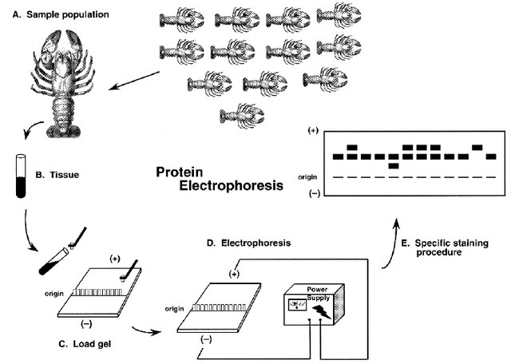
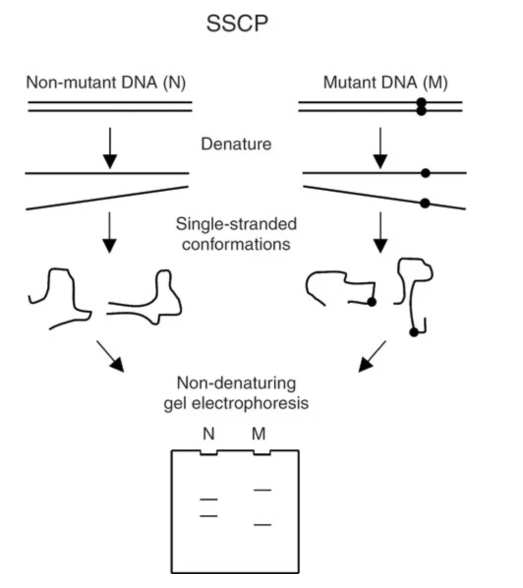
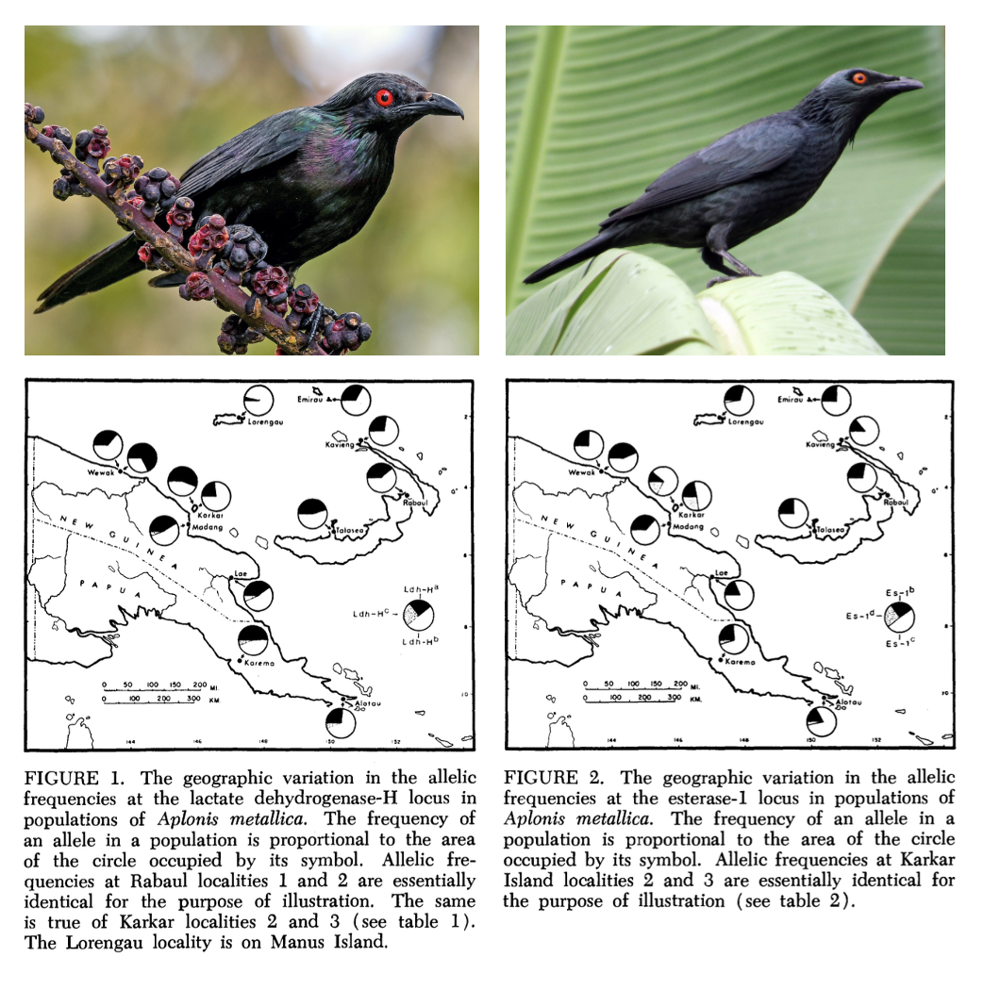

## How do we study genetic diversity?

::: {.callout-note title="Paper Reading Strategies"}
Understanding both the intellectual history and contemporary practice of conservation genetics requires moving beyond textbooks to read the primary literature. In this class we'll do so on a weekly basis, engaging with a selection of a dozen or so scientific articles in person and through written assignments. In general, the papers I've picked are not unduly technical, represent different types of research and scholarship in conservation genetics, and emphasize local species when possible. (There is a vertebrate bias; I apologize.)

**The following questions are helpful for efficiently grasping scientific articles:**

-   What type of paper is it? (review, perspective, empirical…)
-   What is the main question or goal?
-   How did the authors set out to answer that question?
-   What did they find?
-   How do they interpret their findings?
-   Critique: strengths? limitations? stronger evidence?
-   What does each figure say? Where and when was it published?
:::

Empirical population and conservation genetics requires assessing genetic variation, either directly (through DNA sequences) or indirectly (through the property of phenotypes that reveal underlying sequence variation). Though seemingly trivial---"genetics" is in the name of both fields, after all---this emphasis on molecular variation distinguishes our topic from other ways biodiversity is studied (e.g. morphometrics). Consider a scenario in which you have both DNA sequence data and data from a meristic (countable) trait in the same set of populations of three-spined stickleback (*Gasterosteus aculeatus*). The trait in question---the number of lateral plates on each individual---ranges from n=20 to n=30. You are interested in the evolutionary relationships among populations. At first pass, inferring a close relationship among fish in ponds where all stickleback have either 30, 27, 23, or 20 plates would seem to make sense. Yet the sequence data from the same individuals show that there are multiple genetic variants that can give rise to the exact same number of plates! For example, 30-plated fish in pond A have haplotype $CTGA$ at the plate-determining locus, while 30-plated fish in pond B have haplotype $GTAA$. Given the vast number of variable sites in the genome, it is more probable that that the differences in sequence reflect the "true" relatedness (or relative evolutionary distance) than their identical number of plates. **Though repeated mutations and other factors can mask the evolutionary signal in genetic data, it is nonetheless a much more faithful signal of ancestral relationships than phenotype.**

Assessing genetic variation has only become possible at scale over the last 50 or so years. Indeed, one of the most impressive aspects of population genetic theory is how much of it was developed before Watson, Crick, and Franklin determined the structure of DNA in 1953! Early empirical work focused on simple traits that behaved in Mendelian ways, such as eye color in *Drosophila* fruit flies; complex traits such height gave rise to a separate body of theory called quantitative genetics, which circumvented the question of underlying variants by focusing on the properties of statistical distributions. (More on this later in the course.) Beginning in the 1960s, *protein electrophoresis*---a method in which sequence variation in proteins is revealed by their different electrical charges in an agarose gel medium---allowed scientists to directly quantify genetic diversity in a wide range of organisms. Particular proteins---often polymorphic enzymes known as allozymes---became known as *genetic markers*, as they "marked" differences in underlying genes. The term is still widely applied to any method that characterizes alleles by means other than direct sequencing.

Protein electrophoresis confirmed many predictions of population genetic theory in natural populations. Yet it also brought surprises. For example, Hubby and Lewontin (@hubby1966molecular, @lewontin1966molecular, @charlesworth2016hubby) showed that there was significantly more allelic variation in *Drosophila* than expected, with differences in the electrical charge of proteins that were assumed to be "monomorphic" (i.e., had the same form). Six years later, Lewontin (@Lewontin1972Apportionment,) showed that there is far more allelic variation within than across ethnic groups, refuting widespread ideas about the biological reality of races.

{width="50%"}

Despite its usefulness, protein electrophoresis only revealed variation at functional (i.e., protein coding) sites. The subsequent two decades lead to a suite of new genetic markers, including restriction fragment length polymorphisms (RFLPs; variants in restriction enzymes that would result in different patterns of DNA fragmentation on a gel), single strand conformation polymorphisms (SSCPs; variants impact the shape of a single strand of DNA, affecting its mobility in a gel), and minisatellites and microsatellites (methods that detect alleles as repetitive DNA motifs, again indicated through gel electrophoresis). The polymerase chain reaction---a method of creating millions of copies of a DNA sequence of interest with the help of a heat-tolerant enzyme discovered in thermophilic bacteria from Yellowstone---further enhanced our ability to assay variation across the genome. It became particularly important to the first widely adopted approach to directly "sequencing" (determining the specific composition and order of nucleotides) DNA. Known as Sanger sequencing, this method is still used today, and involves creating a synthetic DNA strand of color-dyed bases to match the sample of interest; colored bases are then read by a lazer in a capillary gel.

{width="50%"}

After a moonshot endeavor to sequence the entire human genome in the early 2000s, *genomics*---a term that means the study of the genome-wide genetic variation---began to be applied to nonmodel organisms. Initially, this was largely done with so-called "reduced representation approaches" such as restriction-site associated DNA sequencing (RADseq; a relative of RFLPs, where restriction enzymes randomly fragment the genome and sections of a certain size are amplified and sequenced) and target capture (where previously identified regions of the genome are joined to synthetic probes to be amplified and sequenced). Reduced representation approaches leveraged high-throughput, short-read sequencing technology on platforms such as Illumina; this method works by joining millions of short DNA sequences to a platform known as a flow cell, where they are amplified and tagged with dye (shown in a nice video [here](https://youtu.be/fCd6B5HRaZ8)). Inevitably, Illumina and similar technologies were used to sequence the entire genome of individuals. Confusingly, such whole-genome sequencing (WGS) is sometimes known as whole-genome resequencing, with the implication that there is a "first" genome for any given species. Such "reference" genomes often involve more intensive "sequencing effort" (more "reads", or sequences generated, for each stretch of DNA). These days, they are generated with long-read sequencing technology, a method that attempts to sequence chromsome-scale stretches of the genome in a single go.

.*](images/illumina.png){width="50%"}

Everything from protein electrophoresis to WGS requires a source of genetic material: typically blood, muscle, heart, liver, scat, environmental traces. Obtaining this material can either be destructive (i.e., killing the animal) or nondestructive (a blood sample). A further distinction is invasive (catching the animal and bleeding it) or noninvasive (obtaining genetic material from scat or the environment). In diploid Eurkaryotes, most cells have 2 copies each of the nuclear genome and 100-1000 copies of the mitochondrial genome; chloroplast genomes are found in photosynthetic organelles called plastids (3-275+ copies each). This variation in copy number is no longer a determinant of what approaches are feasible, but is worth highlighting as a reminder that all empirical population genetics involves tangible biological structures.

::: {.callout-note title="Probability Theory"}
A crucial assumption of population genetic theory is that alleles segregate (i.e., are passed on in gametes) by chance. As a consequence, population genetics relies heavily on probability theory. It is therefore in our interest to brush up the five Probability Rules, all of which will be used to solve problems this semester:

1.  **Possible values** range from 0 (an impossible event) to 1 (a certain event).

2.  **The sum of probabilities for all possible outcomes is 1.**

3.  **Addition rule:** the probability that at least one of two events occurs:

    -   **Mutually exclusive:**\
        $P(\text{A or B}) = P(\text{A}) + P(\text{B})$
    -   **Not mutually exclusive:**\
        $P(\text{A or B}) = P(\text{A}) + P(\text{B}) - P(\text{A and B})$

4.  **Multiplication rule:** the probability two events occur together:

    -   **Independent:**\
        $P(\text{A and B}) = P(\text{A}) \times P(\text{B})$
    -   **Nonindependent:**\
        $P(\text{A and B}) = P(\text{A}) \times P(\text{B} \mid \text{A})$

5.  **Conditional probability:** the probability an event happens given another event occurs:

    -   **Independent:**\
        $P(\text{A} \mid \text{B}) = P(\text{A})$\
        *Example:* If two coins are flipped, knowing one coin is tails gives no information about the other; $P(\text{heads}) = 0.5$.

    -   **Nonindependent:**\
        $P(\text{A} \mid \text{B}) = \dfrac{P(\text{A and B})}{P(\text{B})}$

        *Example:* A bag has 6 red, 3 blue, and 1 green marble.\
        $P(\text{A and B}) = \frac{6}{10} = 0.6$,\
        $P(\text{B}) = \frac{9}{10} = 0.9$,\
        so $P(\text{A} \mid \text{B}) = 0.6 / 0.9 = 0.66$.
:::

::: {.callout-note title="Genetic polymorphisms in *Aplonis* starlings"}
In an early application of protein electrophoresis to wild birds, Kendall Corbin, Charles Sibley, and Andrew Ferguson [@corbin1974genetic] assessed the extent of protein polymorphism in two species of starling in the genus *Aplonis*. The species, found on New Guinea and its offshore colonies, differed in their basic biology: Metallic Starling *Aplonis metallica* nests in large colonies and is tolerant of human disturbance, while Singing Starling *Aplonis cantoroides* is a solitary rainforest dweller.

New Guinea is geographically complex, and the authors hypothesized that its topography would restrict gene flow and lead to unique, geographically localized genetic variants. Isolating variants at the lactase dehydrogenase-H (LDH-H) and esterase-1 loci, the authors found contrasting patterns. LDH-H showed variation but similar allele frequencies across *A. metallica*'s sampled range, while esterase-1 showed geographically correlated variation in allele frequencies (Figure 1). In *A. cantoroides*, LDH-H was essentially monomorphic, while esterase-1 showed some limited variation.

Allele frequencies were not significantly different from expectations under Hardy–Weinberg Equilibrium, suggesting there was not a strong influence of mutation, migration, or natural selection. The authors compare their findings to data from other birds, finding the reported polymorphism lower than captive populations but comparable to wild species.

:::

## Quantifying genetic diversity

In the previous class we surveyed a range of methods for assaying genetic variation dating from the 1970s to the present day. Though technologies have varied across time, both genetic marker-based approaches (such as microsatellites or protein electrophorsis) and direct DNA sequencing (whether WGS or Sanger sequencing) result in a collection of individual genotypes from a sample or set of samples. The unique genotypes present in these samples constitute *alleles*, or distinct genetic variants at a particular locus.

Quantifying genetic diversity involves the use of *summary statistics* to capture the various ways

**Proportion of polymorphic loci:**\
$$
P = \frac{p}{n} = \frac{\text{no. polymorphic loci}}{\text{no. loci}}
$$

**Average heterozygosity:**\
$$
H = \frac{1}{n}\sum_{i=1}^nH_i
$$ where $H_i$ is the average heterozygosity (=proportion of individuals that are heterozygous) at locus $i$ and $n$ is the total number of loci. (This is just a fancy way to write an arithmetic mean.)

**Allelic diversity:** $$
A = \frac{1}{n}\sum_{i=1}^nA_i
$$ where $A_i$ is the number of alleles at locus $i$ and $n$ is the total number of loci.
