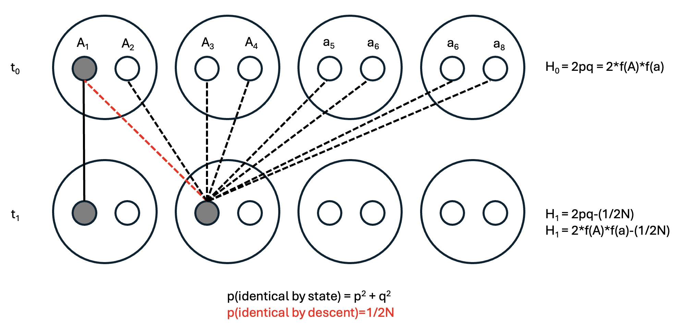
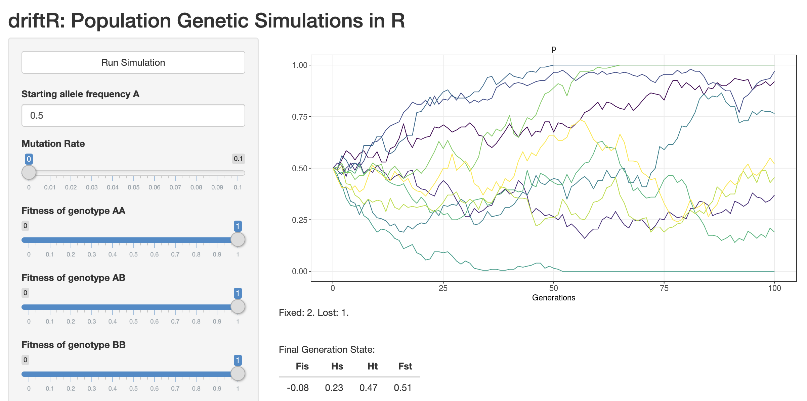

# Genetic Drift

The next assumption of HWP we will violate is that of infinite population sizes. When populations are sufficient large in size, the allele frequency dynamics are more or less deterministically driven by mutation, migration, and selection. With finite populations (and particularly with small populations), chance events begin to take on greater importance. This is of particular interest to us because conservation genetics is, in essence, the population genetics of small populations of conservation concern. In Montana, for instance, there only \~350 Black Footed Ferrets remaining, only \~500 Kootenai sturgeon, and only \~320 whooping cranes. The International Union for the Conservation of Nature (IUCN) considers a species critically endangered if there are fewer than 50 individuals, endangered if there are fewer than 250, and vulnerable if there are fewer than 1000.

The primary mechanism for the shift away from deterministic dynamics is sampling error of gametes. Consider two crosses between sexually reproducing diploid individuals at a single triallelic locus: an $A_1A_1$ x $A_1A_2$ cross, and an $A_1A_3$ x $A_1A_2$ cross. In this parental generation, allele frequencies are $p=0.5$, $q=0.375$, and $r=0.125$. The first pair then has three offspring, formed by each parent randomly contributing one of their two alleles. The genotypes of these offspring are $A_1A_1$, $A_1A_2$, and $A_1A_2$. The second pair has a single child, with genotype $A_1A_1$. While this new generation has the same population size and total number of alleles or chromosomes, allele frequencies have changed to $p=0.75$, $q=0$, and $r=0$.

You will notice that since $r=0$, the allele has disappeared from the population. We describe this as its *loss*: the alternative scenario, in which an allele reaches a frequency of 1.0, is termed *fixation*. To develop intuition about the relationship between population size and the probability of fixation or loss of an allele, using a simulation tool (like CJ Battey's [driftR](https://cjbattey.shinyapps.io/driftR/)) is helpful. More formally, we can we model the expected distribution of allele frequencies for a given number of gametes using the *binomial distribution*.

Let's start by revisiting Hardy-Weinberg proportions. As usual, we have two alleles ($A_1$ and $A_2$) at frequencies $p$ and $q$. What is the probability that a single individual ($N=1$) will have a particular genotype? We can determine this by the binomial expansion of $(p + q)^{2N}=(p+q)^2$. The reason is that we have two chances (one allele from both mom and dad, i.e. the exponent) at one of two possible outcomes (receiving either allele $A_1$, which will occur with a probability proportional to its frequency, $p$, or $A_2$, which will occur with a probability proportional to $q$):

$$
(p + q)^2 = (p + q)(p + q) = p^2 + pq + qp + q^2
$$

We see our for outcomes: $p^2$, $pq$, $qp$, and $q^2$. (Typically, $pq$ + $qp$ are lumped into the more familiar $2pq$.) For a single individual, the probability (which you can think of as "expected frequency if there were only one outcome") of having each genotype is therefore $\frac{1}{4}=0.25$. But what if we have 2 individuals instead? Our binomial expansion will then be raised to a power of $2N=4$:

$$
(p + q)^4 = (p + q)(p + q)(p + q)(p + q) = p^4 + 4p^3q + 6p^2q^2 + 4pq^3 +q^4
$$

You can see how this quickly gets complicated. The probability of getting 4 copies of $A_1$ (out of 4 total alleles in 2 individuals) is $p^4$, the probability of getting 3 $p$s and 1 $q$ is $4p^3q$, etc. But how can we generalize this for larger population sizes without the prohibitively tedious process of manually solving the binomial expansion? The formula for the binomial distribution provides us with a shortcut:

$$
{2N \choose K}p^Kq^{2N-K}
$$

This formula gives you the probability of there being exactly $K$ copies of an allele with frequency $p$ given $2N$ gametes. Here, ${2N \choose K}$ is read "2N choose K" and is equivalent to $\frac{2N!}{K!(2N-K)!}$. $q$ is the frequency of the alternate allele (the binomial expansion only works for diallelic loci). We can return to our example above to demonstrate its use. What, then is the probability of getting 3 copies of allele $A_1$ given $2N=4$ and allele frequencies of $p=0.5$ and $q=0.5$?

$$
{4 \choose 3}0.5^30.5^{4-3} = \frac{4!}{3!(4-3)!}0.5^30.5^1 = \frac{4*3*2*1}{3*2*1*(1)}0.125*0.5 =0.25
$$

Importantly, this is exactly equal to the term in the binomial expansion demonstrated above: $4p^3q = 4*0.5^3*0.5 = 0.25$.

The variance of the distribution is $\sigma = \frac{p_0q_0}{2N}$, or the initial allele frequencies over the number of alleles in the population. It is maximized when $p_0=q_0$ and $2N=2$, which tells us genetic drift (random change in alelle frequencies due to sampling error) is strongest in small populations with relatively equal frequencies at diallelic alleles. You can build intuition about the binomial distribution by playing around with frequencies ("probability of success") and number of alleles ("number of Bernoulli trials") using this app: https://istats.shinyapps.io/BinomialDist/.

A simple extension of the binomial distribution is that the probability of fixation of an allele is given by its frequency to the $2N$ power, i.e. $p^{2N}$. Conversely, the probability of its loss is its complement to the $2N$ power, ie. $(1 - p)^{2N}$.

A different way to arrive at this result using the building blocks of an area of population genetics known as **coalescent theory**, which we will discuss in greater length shortly. First, let's (re)define familiar terms. In a single individual, homozygosity and heterozygosity in an refer to the state of having identical or different alleles at a given locus (respectively). In a randomly mating population, however, homozygosity refers to the probability two alleles drawn at random are identical ($p^2 + q^2$) or different ($2pq$). As indicated in the parentheses, these probabilities are given by terms from Hardy-Weinberg proportions.

Given this reminder, consider a single-generation population bottleneck of size $N$, where a formerly large population is reduced to small numbers (Figure 1). The subsequent generation ($t+1$) will be formed from the $2N$ alleles present during the bottleneck. Selecting any two alleles in different individuals at random in generation $t+1$, the probability that they came from the same parental copy—in other words, are **identical by descent**—is simply 1 out of the total number of parental alleles, i.e. $\frac{1}{2N}$. (To make this more intuitive, select an allele in $t+1$ and its ancestor in $t$, then select a second allele in $t+1$. That second allele has $2N$ possible ancestors, with a $1/2N$ probability of the same ancestor as your first allele.)

Of course, other alleles may be **identical by state** (e.g., both be $A_1s$) but come from different parents. These will result in homozygotes, but not change their overall frequency.

::: {.callout-note title="Drift in *Lycaeides idas* butterflies"}
Drift constantly shapes allele frequencies in finite natural popualtions, but can be difficult to detect without temporal comparisons. Zach Gompert and colleagues (@gompert2021genomic) used population genomic time series data from from ten *Lycaeides idas* butterfly subpopulations in the Greater Yellowstone Ecosystem to test the hypothesis that gene flow over larger timescales maintained genetic diversity but did not impact generation to generation evolution. In doing so, they documented significant ($\sim$) changes in the frequencies of genetic variants across the gene---drift in action.

:::

## Drift and Heterozygosity

To understand how genetic drift impacts genetic diversity, it's helpful to consider an extreme scenario we will return to several times: a population bottleneck, or sudden reduction in population size to a limited number of individuals. The most severe population bottleneck possible for sexually reproducing organisms is 2. Assuming they are diploid, the following table gives us the expected frequencies and heterozygosities of different allelic combinations. ($H_e$ is calculated as $2pq$ given $f(A_1)$ and $f(A_2)$ from the Allele combination column.)

| Allele combination | Frequency ($f$) | Heterozygosity ($H_e$) | $f$ x $H_e$ |
|:-------------------|:----------------|:-----------------------|:------------|
| 4 $A_1$s           | $p^4$           | 0                      | 0           |
| 3 $A_1$s; 1 $A_2$  | $4p^3q$         | 0.375                  | $1.5p^3q$   |
| 2 $A_1$s; 2 $A_2$  | $6p^2q^2$       | 0.5                    | $3p^2q^2$   |
| 1 $A_1$s; 3 $A_2$  | $4pq^3$         | 0.375                  | $1.5pq^3$   |
| 4 $A_2$s           | $q^4$           | 0                      | 0           |
| Total              | 1.0             |                        | $1.5pq$\*   |

\*Derivation: $\text{Total} = 1.5p^3q + 3p^2q^2 + 1.5pq^3 = 1.5pq(p^2 + 2pq + q^2) = 1.5pq(1) = 1.5pq$

Mean heterozygosity in the bottlenecked population ($H_1$) will be a proportion of the heterozygosity in the original population ($H_0$). In this case, $\frac{H_1}{H_0}$ will be $\frac{1.5pq}{2pq}$ = $\frac{3}{4}$ or $1-\frac{1}{4}$. Since 2N = 4, $\frac{H_1}{H_0} = 1 - \frac{1}{2N}$. Therefore, a single pair bottleneck will reduce $H_0$ by 25%; a bottleneck of 10 individuals will only reduce it by $5%$. We will return to this idea from a different perspective in a later lecture.

::: {.callout-note title="The Mauritius Kestrel Bottleneck"}
Mauritius Kestrel (*Falco punctatus*), the last surviving endemic raptor on the island of Mauritius, underwent a short-lived but severe population bottleneck due to forest loss and pesticide use, reaching a single known breeding pair in 1973. An intensive conservation breeding program halted and reversed the decline, leading to a current population of \>400 individuals. Richard Nichols and colleagues (@nichols2001sustaining) used microsatellite data from contemporary tissue samples and historic museum specimens to describe changes in genetic diversity through time, showing that the restored population has significantly lower observed heterozygosity than either the ancestral (pre-bottleneck) population or mainland populations of other kestrel species.

:::

::: {.callout-note title="Genetic Drift Activity"}
CJ Battey wrote an app to simulate allele frequency change due to drift and selection: https://phytools.shinyapps.io/selection/

Open the app in your browser and work through the following questions.

1)  Orient yourself. What are the axes? What variables can you change? What does the plot display when you click "Run Simulation"?

2)  Set "Starting allele frequency A" to 0.5 (instead of two values, as is default). Set all fitnesses to 1, the Migration Rate to 0, the Number of Populations to 10, and Number of Generations to 100. Make sure you are plotting "p" alone. Run simulations for population sizes of 10, 100, 1000, and 10,000. What pattern do you observe? What does it mean when a colored line hits the top of the graph? What does it mean when a colored line hits the bottom of the graph?

3)  Repeat the process in 2 but setting the fitness of one of the homozygotes to a value between 0.01 and 0.5. What do you observe?

4)  Develop a question to address with the driftR.
:::
