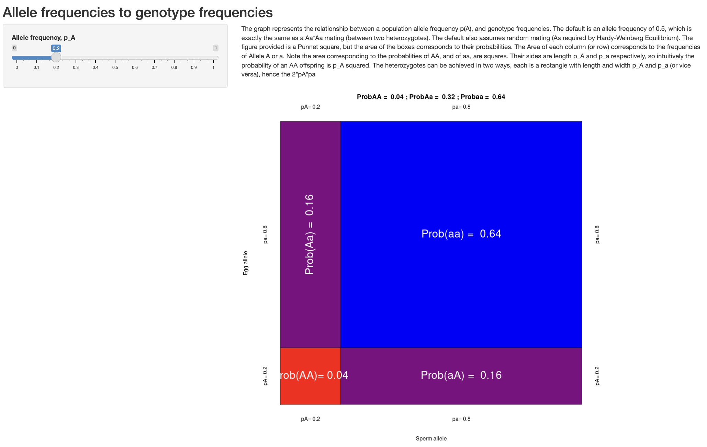

## Hardy-Weinberg Principle (or equilibirum, or proportions...)

To develop intuition about the expected frequency of different allelic combinations (or *genotypes*) in a sexually reproducing, diploid population, we'll start with a common analogy: coin flips. Imagine you have two quarters, each with a standard 50% probability of landing heads and 50% probability of landing tails. You are interested in how often you will get 0, 1, or 2 heads when flipping both coins simultaneously. More generally, this scenario can be thought of as the probability of 0, 1, or 2 independent "successes", where the probability of success is 50% ($p(\text{heads})=0.50$) and the probability of failure is 50% ($p(\text{tails})=0.50$). (This is an example of something called as [**Bernoulli Trial**](https://en.wikipedia.org/wiki/Bernoulli_trial), which we will return to in several weeks during our discussion of genetic drift.)

Recall from the previous class that the probability of two events occurring together is given by the product of their individual probabilities (i.e., the **Multiplication Rule**). We can therefore determine the probability of neither quarter landing heads up---in other words, the probabilty of two failures:

-   $p(\text{0 heads})=p(\text{tails})*p(\text{tails})=0.50*0.50=0.25$

The probability of one success and one failure is slightly more complicated, as there are two possible independent paths to this combination: one in which the first quarter is heads and the second quarter is tails, and one in which the first quarter is tails and the second quarter is heads. The **Addition Rule** states that the overall probability of at least once of two outcomes occurring is the sum of their probabilities:

-   $p(\text{1 heads})=p(\text{1 head})*p(\text{1 tail}) + p(\text{1 tail})*p(\text{1 head})$
-   $p(\text{1 heads}) = 0.50*0.50 + 0.50*0.50=0.50$

The probability of two heads is simple the product of the probability of heads on each coin (two successes):

-   $p(\text{2 heads})=p(\text{1 head})*p(\text{1 head})=0.50*0.50=0.25$

(Note that all possible outcomes sum to 1---the first of our probability rules.)

The extension of this to possible genotypes is straightforward. At a diallelic locus (i.e., a locus with two alleles), the probability that an individual receives two copies of a given allele is the probability its mother passes on that allele multipled by the probability its father passes on that allele. Expected offspring genotypes thus vary with parental genotypes. If the mother is homozygous for the dominant allele at locus $A$ and the father is also homozygous dominant, the probabilty of a homozygous recessive offspring is $p(aa)=0*0=0$, the probability of a heterozygote is $p(Aa)=1*0+0*1$ (note again there are two paths to this combination!), and the probability of a homozygous dominant individual is $p(AA)=1*1=1$. A cross between two heterozygotes is a close match to our coin flip scenario: $p(aa)=0.5*0.5=0.25$; $p(Aa)=0.5*0.5+0.5*0.5=0.50$; and $p(AA)=0.5*0.5=0.25$.

In a *population* (defined as a group of individuals that mate randomly with respect to a given locus), the **expected frequency** of genotypes in the next generation is equivalent to the probability an offspring inherits that genotype. While any given individual will have its genotype determined by the rules in the paragraph above, the overall distribution of genotypes is determined by the number of parents that have each allele---the *allele frequency* in the parent generation. It can be helpful to consider sexual reproduction in a randomly mating population as reaching into a stocking to draw out marbles in one of two colors. Offspring are created by the combination of two colors; the probabilty of (say) a green and red "child" is simply the probability of drawing a green and red marble with replacement. If 7 of the 10 marbles in the stocking are green, that is $p(green)=0.7$, while $p(red)=0.3$; we again account for the two different orders in which marbles can be drawn to get the total probabilty of a green red combination: $p(\text{green and red})=0.7*0.3+0.3*0.7=0.42$.

More formaly, a diallelic locus where allele $A_1$ occurs at frequency $f(A_1)=p$ and allele $A_2$ occurs at frequency $f(A_2) = q$, we expect the following genotype frequencies following one generation of random mating:

$$
p*p + p*q + q*p + q*q = p^2 + 2pq + q^2 = 1
$$

This simple equation is known by names, but most helpfully as **Hardy-Weinberg Proportions** or the **Hardy-Weinberg Principle** (for its two co-discoverers, G. H. Hardy and Wilhelm Weinberg).

In addition to random mating, HWP assumes a complete absence of the four evolutionary mechanisms capable of changing allele frequencies from generation to generation:

1)  No natural selection;
2)  No mutation;
3)  No migration;
4)  No genetic drift (infinite population sizes).

For example, if $f(A_1) = 0.8$ and $f(A_2) = 0.2$, we expect genotype frequencies of $f(A_1A_1)=0.8*0.8=0.64$, $f(A_1A_2)=0.8*0.2+0.2*0.8=2*0.8*0.2=0.32$, and $f(A_2A_2)=0.2*0.2=0.04$.

Hardy-Weinberg Proportions are important because they are *a null model for evolution*—--what we expect genotype frequencies to be in the absence of evolutionary mechanisms. For this reason, it is frequently referred to as *Hardy-Weinberg Equilibrium*, with "equilibrium" here indicating a population that is not evolving (i.e., where allele frequencies are the same from generation to generation).

We can test whether observed deviations from Hardy-Weinberg Proportions are statistically significant with a Chi-Squared test:

$$
\chi^2 = \sum\frac{(\text{Observed} - \text{Expected})^2}{\text{Expected}}
$$

The statistic measures the squared difference between the number of individuals actually observed with each possible genotype and the expected number of individuals with that genotype based on Hardy-Weinberg proportions and assumptions, divded by the expected number of genotypes. For a diallelic locus, the sum indicates you repeat the operation on the right-hand side three times (for $A_1A_1$, $A_1A_2$, and $A_2A_2$). This statistic is then compared to a table where statistical signficance is inferred given a particular value for the degrees of freedom (number of free parameters). Importantly, it only works with *count* data—--not frequencies!

For example, if we imagine 100 chicks are born with genotype counts of $f(A_1A_1)=20$, $f(A_1A_2)=20$, and $f(A_2A_2)=60$, we first determine $f(A_1) = \frac{2*20+20}{200}=0.3$ and $f(A_2)=1-f(A_1) =0.7$. Based on these values, we would expect $\#A_1A_1=100*p^2=100*0.3^2=9$, $\#A_1A_2=100*2pq=100*2*0.3*0.7=42$, and $\#A_2A_2=100*q^2=100*0.7^2=49$

Our Chi-Squared statistic is then:

$$
\chi^2 = \frac{(20-9)^2}{9} + \frac{(20-42)^2}{42} + \frac{(60-49)^2}{49} = 24.92
$$

The value of 24.92 is our "test statistic". Since we are working with a diallelic locus where $p + q = 1$, we only have a single degree of freedom—the value $p$ depends on $q$, and vice versa. We thus look at the row $df=1$ in [a table like this one](https://people.richland.edu/james/lecture/m170/tbl-chi.html) and find our value. 24.92 is much greater than the test statistic value of 3.841 required to reach statistical significance at $p=0.05$, so we can conclude the differences between the counts of observed and expected genotypes are unlikely to be due to random sampling error.

([More on the chi-squared distribution here](https://en.wikipedia.org/wiki/Chi-squared_distribution)---in the example above, we are looking at where on the line for $k=df=1$ our statistic falls, which is far past the right-hand side of the plot, meaning the vast majority of the probability distribution is weighted towards less extreme differences.)

The idea of expected heterozygosity under Hardy-Weinberg proportions is an important one. We can more broadly define $H_e$ for $n$ loci as:

$$
H_e = 1 - \sum_{i=1}^{n}p_i^2
$$

In other words, the expected frequency of heterozygotes is what you have left over (i.e. the *complement*) after accounting for the expected frequency of all homozygotes. In a diallelic system, this is $1 - p^2 - q^2 (=2pq)$; in a triallelic system, this is $1 - p^2 - q^2 - r^2 (= 2pq + 2pr + 2qr)$, etc.

::: {.callout-note title="Hardy Weinberg Proportions App"}
Dan Bolnick has [a useful app for visualizing Hardy-Weinberg proportions](https://bolnicklab.shinyapps.io/HWEdemo/).

Open the app in your browser and consider the following two questions:

1)  Under what allele frequencies is the frequency of heterozygotes maximized?

2)  Why are the axes labeled with "sperm" and "egg"?
:::
