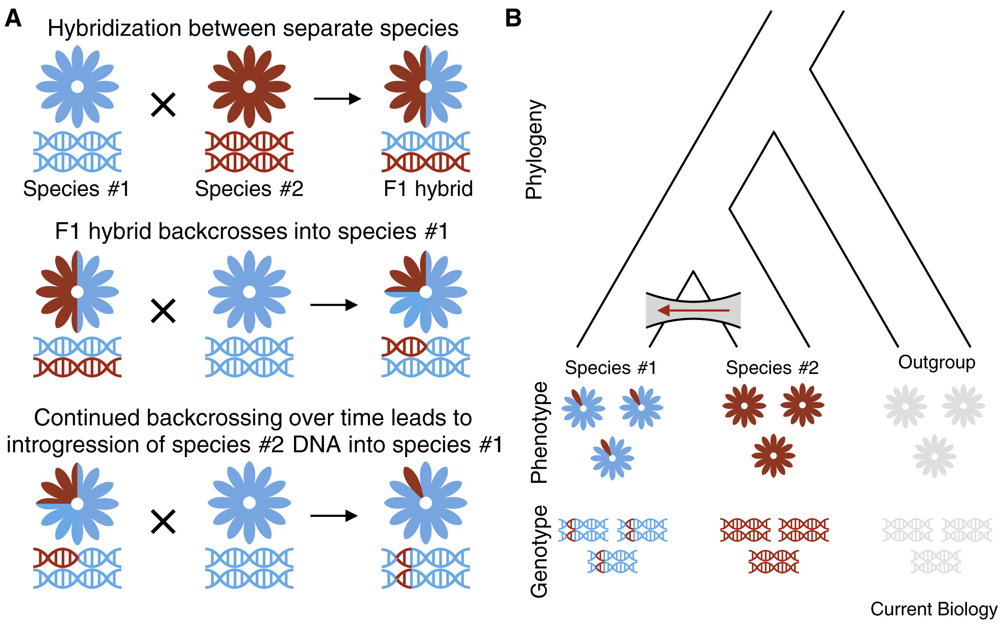
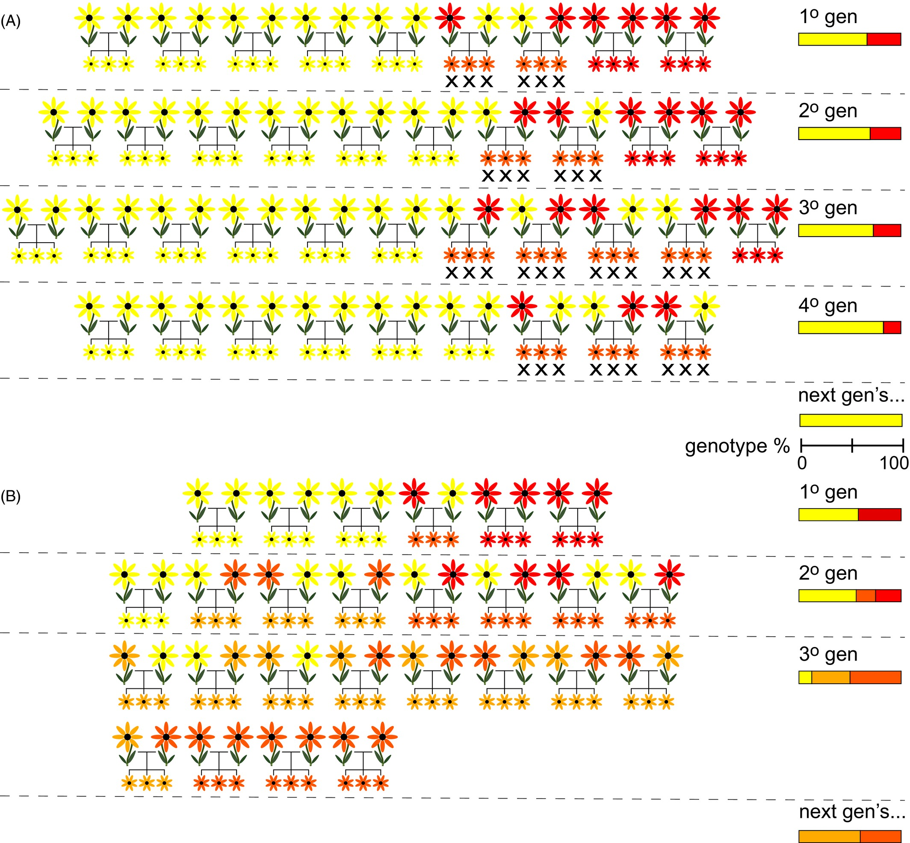
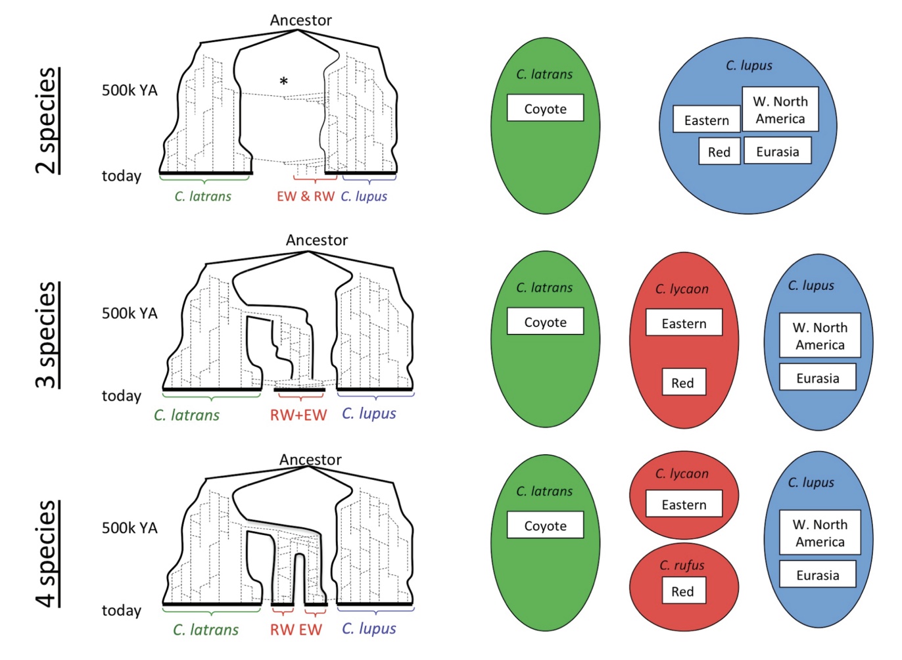
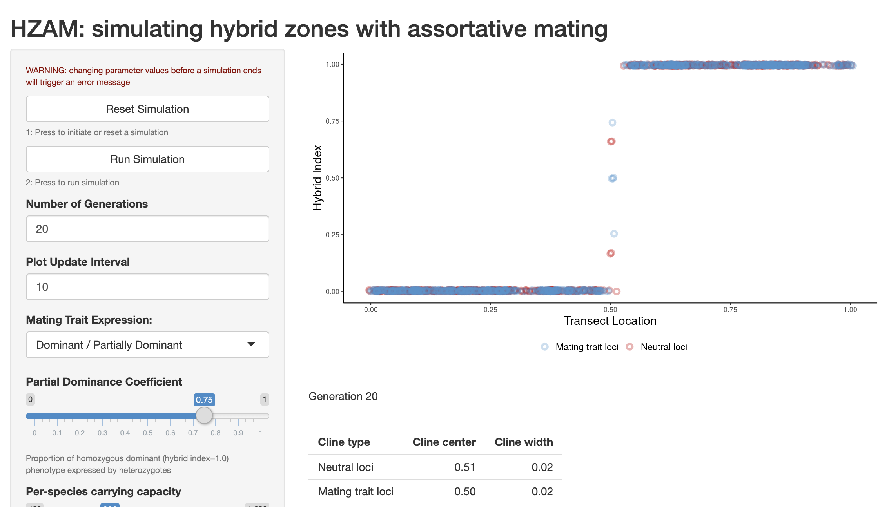

# Hybridization  

Hybridization is mating between "individuals from two populations, or groups of populations, which are distinguishable on the basis of one or more heritable characters" (@harrison1990hybrid). Studies of hybrid zones have become a major focus of evolutionary biology, as they provide a window into the speciation process before reproductive isolation is complete, permitting inference of mechanisms of divergence, premating and postmating barriers to gene flow, and the association of genes and traits. In conservation genetics, hybridization is of primarily of concern when it leads to the loss of the genetic material that made a conservation unit distinct, or when it leads to outbreeding depression. The former topic quickly becomes philosophical; the latter was discussed in the previous section. Here, we will discuss some practical consequences of hybridization on allele frequencies, and touch on the legal treatment of hybrid lineages and populations. 

To do so, we will focus on models of frequencies at **diagnostic loci**: alleles that are fixed (i.e., $f(A_1)=1$) in one population and absent in the other. In the event that individuals from these divergent populations interbreed, producing hybrids, there may be one of two outcomes, each with its own evolutionary and conservation implications. If hybrids are not themselves fertile, genetic material cannot cross back into pure parental lineages, a scenario described as **hybridization wtihout introgression**. Alternatively, if hybrids are fertile, they can interbreed among themselves and with pure parental indvidiuals, allowing genetic material to permeate population boundaries through *backcrosses* in the process of **introgressive hybridization**.

 

First-generation hybrids between pure parental taxa are known as **F1s**. Interbreeding among hybrids then produces later generations: **F2s**, **F3s**. **late generation hybrids**. An F1 hybrid has 50% of its genome derived from each parent, with 100% of loci showing interpopulation ancestry. A later generation hybrid will still have roughly 50% of its genome derived from each parent, but will have fewer loci showing interpopulation ancestry, as hybrid x hybrid crosses will end up pairing alleles from the same parental taxon. Backcrosses will end up with greater than 50% of their genome from a single parental taxon, and an intermediate number of loci showing interpopulation ancestry (often referred to as their **admixture coefficient**). Individuals can be ploted on axes of diagnostic locus heterozygosity and interpopulation ancestry on ternary (triangle) plots, such as the one below (generated from a simple numberical simulation): 

```{r, warning=FALSE, echo=FALSE}
library(ggplot2)
set.seed(42)

# parameter settings
L <- 500       # number of SNPs
N <- 200       # individuals per class

# parental allele frequencies (not perfectly fixed!)
p1_freq <- 0.98
p2_freq <- 1 - p1_freq

# function to simulate one parent with allele frequency p
make_parent <- function(p, L) {
  h1 <- rbinom(L, 1, p)
  h2 <- rbinom(L, 1, p)
  list(h1 = h1, h2 = h2)
}

# function to produce meiosis gamete
produce_gamete <- function(parent) {
  pick <- rbinom(length(parent$h1), 1, 0.5)
  ifelse(pick == 1, parent$h1, parent$h2)
}

# function to mate two diploid parents
mate <- function(A, B) {
  list(h1 = produce_gamete(A),
       h2 = produce_gamete(B))
}

# function for random mating from a pool
breed_population <- function(pool, N) {
  out <- vector("list", N)
  for (i in 1:N) {
    pa <- pool[[ sample.int(length(pool), 1) ]]
    pb <- pool[[ sample.int(length(pool), 1) ]]
    out[[i]] <- mate(pa, pb)
  }
  out
}

# function to compute ancestry & heterozygosity
compute_stats <- function(pop) {
  ancestry <- hetero <- numeric(length(pop))
  for (i in seq_along(pop)) {
    a1 <- pop[[i]]$h1
    a2 <- pop[[i]]$h2
    ancestry[i] <- (sum(a1) + sum(a2)) / (2 * L)
    hetero[i]   <- mean(a1 != a2)
  }
  data.frame(ancestry, heterozygosity = hetero)
}

# simulate parental populations

P1_pool <- replicate(300, make_parent(p1_freq, L), simplify = FALSE)
P2_pool <- replicate(300, make_parent(p2_freq, L), simplify = FALSE)


# create F1 hybrids
F1_pop <- vector("list", N)
for (i in 1:N) {
  F1_pop[[i]] <- mate(
    P1_pool[[ sample.int(length(P1_pool), 1) ]],
    P2_pool[[ sample.int(length(P2_pool), 1) ]]
  )
}

# F2: F1 × F1
F2_pop <- breed_population(F1_pop, N)

# F3: F2 × F2
F3_pop <- breed_population(F2_pop, N)

# later generation hybrids (F4–F6 random mating)
late_pool <- F1_pop
for (g in 1:5) late_pool <- breed_population(late_pool, length(late_pool))
Late_pop <- breed_population(late_pool, N)

# backcrosses
BC1_pop <- vector("list", N)
BC2_pop <- vector("list", N)
for (i in 1:N) {
  BC1_pop[[i]] <- mate(F1_pop[[ sample.int(N,1) ]],
                       P1_pool[[ sample.int(length(P1_pool),1) ]])
  BC2_pop[[i]] <- mate(F1_pop[[ sample.int(N,1) ]],
                       P2_pool[[ sample.int(length(P2_pool),1) ]])
}

# compute stats
df <- rbind(
  cbind(compute_stats(P1_pool[1:N]), class="P1"),
  cbind(compute_stats(P2_pool[1:N]), class="P2"),
  cbind(compute_stats(F1_pop),        class="F1"),
  cbind(compute_stats(F2_pop),        class="F2"),
  cbind(compute_stats(F3_pop),        class="F3"),
  cbind(compute_stats(BC1_pop),       class="BC_to_P1"),
  cbind(compute_stats(BC2_pop),       class="BC_to_P2"),
  cbind(compute_stats(Late_pop),      class="LateGen")
)


# feasible heterozygosity envelope
p_grid <- seq(0, 1, length.out = 400)
H_max <- 2 * pmin(p_grid, 1 - p_grid)
env <- data.frame(p = p_grid, H = H_max)


# plot
ggplot(df, aes(ancestry, heterozygosity, color = class)) +
  geom_ribbon(data = env, aes(p, ymin=0, ymax=H),
              fill="grey90", inherit.aes=FALSE) +
  geom_line(data = env, aes(p, H),
            color="black", linetype="dashed", inherit.aes=FALSE) +
  geom_point(alpha=0.6, size=2) +
  scale_x_continuous("Genome-wide P1 ancestry", limits=c(0,1)) +
  scale_y_continuous("Heterozygosity at diagnostic loci", limits=c(0,1)) +
  #ggtitle("Simulated diagnostic SNP triangle plot\nParents (bottom), F1 apex, F2/F3 middle, backcross edges") +
  theme_classic()
```


Crossing F1 hybrids produces a range of possible outcomes. For example, in an F2 hybrid, the probability an individual is heterozygous at 5 diagnostic loci is: 

$$
p(\text{H at 5 loci}) = 0.5^5=0.03125
$$

This is because an F2 individual comes from an F1 x F1 cross. At diagnostic loci, F1 individuals are by definition hetoerozygous. An $A_1A_2$ x $A_1A_2$ cross will produce 2 heterozygous genotypes out of four possibilities ($A_1A_2$ and $A_2A_1$). 

An F1 hybrid backcrossing with one parental taxon will lose 50% of the remainder of its ancestry derived from the other parent each generation. For example, an F1 hybrid formed by an intial cross between species A and species B followed by 5 generations of backcrossing into species A will end up with <2% of its genome derived from species B ($0.5^6=0.015625$). 

Hybridization between genetically differentiated populations can cause linkage disequlibirum. Consider the following population formed by 5 individuals each of two parental taxa that differ at two diagnostic loci. Here, treating all individuals as a single population gives us the maximum possible value of $D$: 

- **P**: AB, AB, AB, AB, AB, ab, ab, ab, ab, ab  
- $f(A) = 0.5; f(a) = 0.5; f(B) = 0.5; f(b) = 0.5$  
- $f(AB) = 0.5; f(ab) = 0.5$  
- $D = p(A,B) - p(A)p(B) = 0.25$  

A mix of F1 hybrids and pure parentals would continue to show strong linkage disequilibrium:  

- **F1**: AB, ab, Ab, aB, AB, AB, ab, ab, aB, Ab  
- $f(A) = 0.5; f(a) = 0.5; f(B) = 0.5; f(b) = 0.5$  
- $f(AB) = 0.3; f(ab) = 0.3$    
- $D = p(A,B) - p(A)p(B) = 0.1$  

However, this decays with time:  

- **F2**: aB, Ab, AB, ab, aB, Ab, AB, ab, Ab, aB  
- $f(A) = 0.5; f(a) = 0.5; f(B) = 0.5; f(b) = 0.5$  
- $f(AB) = 0.2; f(ab) = 0.2$  
- $D = p(A,B) - p(A)p(B) = -0.05$  

The consequences of hybridization on the intregrity of parental species is heavily influenced by the environmental and geographic context in which it occurs. If there are no barriers to gene flow---e.g., gradients of natural selection or obstacles to dispersal---hybridization can spread rampantly, creating a **hybrid swarm** where most individuals have some hybrid ancestry. If hybridization is instead restrained by the balance between natural selection and gene flow, it may create a **tension zone**, with genotypes and phenotypes showing clinal variation across a linear transect. A third possibility is that hybrids may have superior fitness to either parental taxon in a small region of space, something known as a **bounded hybrid superiority model**. 

We previously discussed how hybridization (either natural or as an inadvertent consequence of well-intended management actions) may lead to outbreeding depression. Two other conservation concerns merit mention. First, hybridization at high enough rates can reduce population growth as reproductive output is put towards the "dead end" of hybrid individuals (**demographic swamping**). Second, introgressive hybridization without restraint can eliminate "pure" parental genomes, leading to **genomic extinction**. Whether this is something to be "passionately resisted" (to quote Gary Snyder) depends in part on species concepts, in part on management goals, and in part on values. Hybrid individuals may have (more or less) the same ecological role and phenotypic traits of their parent taxa; preserving "pure" genotypes may facilitate future adaptive change, or may be an end in its own right.  

{width=60%}

Unsurprisingly, hybrids pose problems for conservation policy. Different laws afford hybrids different rights under biodiversity protection policies. Under **Australia's Biodiversity Conservation Act (2016)**, hybrids are eligible for conservation listing if: 1) they are distinct entities, i.e. the progeny are consistent within the agreed taxonomic limits for that species group;  2) they are capable of self-perpetuating, and are not reliant on parent stock for replacement;  3) they are the product of a natural event. One implication of this policy is that hybrid-derived taxa---such as a stable hybrid swarm somewhere parental lineages have ceased to exist---**are eligible**, but hybrid zones are **not**. 

Under the **US Endangered Species Act**, the legal status of hybrids is contentious and as of yet unresolved, with a long history. As early as May 1977---four years after the passage of the act---the U.S. Department of the Interior (DOI) stated that "because it defines 'fish or wildlife' to include any offspring without limitation, the Act's plain meaning dictates coverage of hybrids of listed animal species" (and also applies to plants). A few months later, the US Fish and Wildlife Service (USFWS) responded that "...since the Act was clearly passed to benefit endangered species, ...it must have meant the offspring of two listed species and was not meant to protect a hybrid where that protection would in fact cause jeopardy to the continued existence of a species". One month later, the DOI concurs, claiming that "hybrids of listed species are not protected under the ESA" (because of potential for hybridization to cause harm). This "Hybrid Policy" held until December 1990, when it was summarily suspended by the USFWS for failing to protect taxa derived from hybridization (like the red wolf; see below), or subspecies that interbreed (like Florida panther). Six years later, the USFWS & National Oceanic and Atmospheric Administration propose an "Intercross Policy" aimed at resolving remaining ambiguities. To date, it remains unpublished.  

:::{.callout-note title="Are Red Wolves (*Canis rufus*) a DPS?"}

Red wolves (*Canis rufus*) are a critically endangered, taxonomically ambiguous population of canids in the southeastern US. Now restricted to 30 or so individuals at  Alligator River National Wildlife Refuge (descended from a now-extinct population on the (Gulf Coast), conservation breeding efforts have been mandated by the taxon's status as a US Endangered Species. Yet recent and ongoing hybridization with coyotes and its uncertain evolutionary relationships has led to years of debate over whether *C. rufus* was better treated as an isolated population of Gray Wolves, a divergent population of Coyotoes with wolflike traits, the product of historic hybridization between Gray Wolves and Coyotoes, or the distinct species it was long assumed to be. Robin Waples and colleagues (@waples2018red) reviewed the literature on Red Wolf taxonomy, finding evidence for three primary taxonomic hypotheses, illustrated below. They argue that regardless of which is ultimately best supported by continuing research, *C. rufus* deserves treatment as a Distinct Population Segment (DPS; see previous section).



:::

:::{.callout-note title="Shiny App: HZAM"}

A Shiny app I wrote adapting a program written by Darren Irwin (@irwin2020assortative) [called HZAM allows](https://elinck.shinyapps.io/hzam_shiny/) for simulations of hybrid zones under various degrees of assortative mating. It can be used to develop intuition about the behavior of tension zones under different levels of selection and gene flow. 



:::