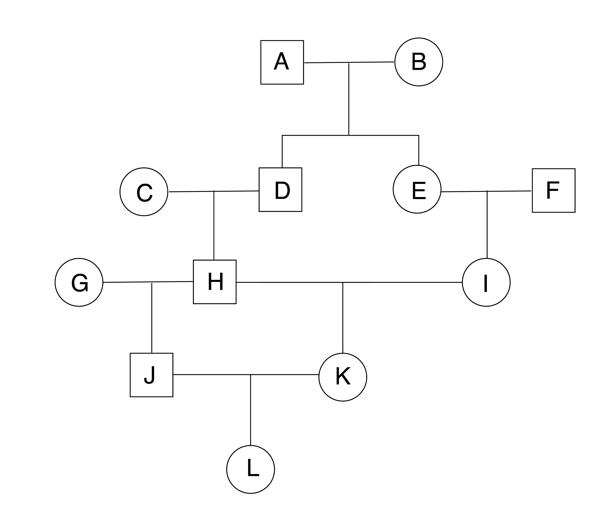

# Inbreeding and Inbreeding Depression

An individual is inbred when its parents share one or more common ancestors. Because inbreeding is unavoidable in small populations, it is a topic of major importance in conservation genetics. Inbreeding reduces reproductive fitness by increasing homozygosity (though more identical by descent pairings), which exposes deleterious recessive alleles. We measure inbreeding with the inbreeding coefficient $F$, which scales from 0 (completely outbred) to 1 (completely inbred).

We can start with a simple model of self fertilization in a diploid lineage, where a parent (with genotype $A_1A_2$) produces gametes in proportions $\frac{1}{2}A_1$ and $\frac{1}{2}A_2$. There is thus a $\frac{1}{2}*\frac{1}{2}$ probability its offspring will be homozygous for $A_1$, a $\frac{1}{2}*\frac{1}{2}$ probability it will be homozygous for $A_2$, and a $\frac{1}{2}*\frac{1}{2} +\frac{1}{2}*\frac{1}{2}=\frac{1}{2}$ probability it will be heterozygous (either $A_1A_2$ or $A_2A_1$). Its inbreeding coefficient is the summed probabilities both its alleles are IBD, which in this case is equal to the sum of the probabilities of both homozygous genotypes, as there is no other ancestral source of alleles: $\frac{1}{4} + \frac{1}{4} = \frac{1}{2}$.

We can expand this model to two unrelated grandparents producing two children who have a child with each other (so-called "full sib" mating). Labeling each grandparental allele independently regardless of state to indicate descent gives us genotypes $A_1A_2$ and $A_3A_4$. The child's inbreeding coefficient is the sum of the probability its two alleles are derived from the same grandparental copy. For example, there is a $\frac{1}{2}$ probability the first grandparent passes on $A_1$ to the first parent, and a $\frac{1}{2}$ probability that same copy is passed on to their child, which we multiply for a $\frac{1}{4}$ overall probability of inheriting the first copy of $A_1$. Similarly, the probability of the first grandparent passing $A_1$ on to the second parent and that second parent passing it on to their child is also $\frac{1}{4}$.

We thus end up with a $\frac{1}{16}$ the child of a full sib mating event to be homozygous for $A_1$ with alleles that are identical by descent. Their full inbreeding coefficient is the sum of all such possible IBD combinations, which in this case is $F = \frac{1}{16}\text{( for }A_1A_1) + \frac{1}{16}\text{( for }A_2A_2) + \frac{1}{16}\text{( for }A_3A_3) + \frac{1}{16}\text{( for }A_4A_4) = \frac{4}{16}=\frac{1}{4}$

The calculation above is based on finding a "loop" in a pedigree: a route where a single allele copy can be passed on through descendants before combining (to become identical by descent) in a common ancestor. This forms the basis for calculating the pedigree inbreeding coefficient, $F_P$ (or $F_X$, where $X$ is an individual on the pedigree). The inbreeding coefficient was derived by Sewell Wright (1889 - 1988), who you will recall was one of the three major founders of population genetics. One of Wright's major contributions is the path coefficient, which is a method for assessing the correlation between two nodes on a directional graph. In conservation genetics, this lets us determine the proportion of ancestry passed on from an ancestor to an offspring $n$ generations apart, while accounting for inbreeding (more on that in a second). Path coefficients can range from from $\frac{1}{2}$ (e.g., father / mother to child) to $\to 0$ (e.g., the common ancestor of all humanity to you):

$$ P_{AO} = 2^{-n} \cdot \sqrt{\frac{1 + f_A}{1 + f_O}} $$ For example, grandparents contribute an average of 1/4th of their genes to their grandchildren ($n=2$ generations apart), assuming no inbreeding:

$$ P_{AH} = 2^{-2} \cdot \sqrt{\frac{1 + 0}{1 + 0}} = \frac{1}{4} \cdot 1 = \frac{1}{4} $$ Path coefficients can be used to determine the *coefficient of relationship*, or the proportion of genetic material two individuals $B$ and $C$ share given each common ancestor they share (here denoted by $A_i$). Here, we keep track of the number of ancestors between $B$ and $A$ with $n$, and $C$ and $B$ with $m$:

$$
r_{BC} = \sum_i P_{A_iB}  \cdot P_{A_iC} = \sum_i2^{-n_i} \cdot \sqrt{\frac{1 + f_{A_i}}{1+f_{B}}} \cdot 2^{-m_i} \cdot \sqrt{\frac{1 + f_{A_i}}{1+f_{C}}}
$$ $$
r_{BC} = \sum_i(\frac{1}{2})^{(n_i+m_i)}\frac{1 + f_{A_i}}{\sqrt{(1 + f_{B_i})(1 +f_{C_i})}} 
$$

For example, the relationship coefficient between two non-inbred siblings will be the product of the path coefficients of between each child and their father plus the product of the path coefficients of each child and their mother. Since $f$ is 0 in all cases, the fraction on the right side reduces to 1, and we only need to worry about the first half of the equation (i.e., $r_{BC}=\sum_i(\frac{1}{2})^{(n_i+m_i)}$):

$$ r_{DE} = P_{AD}  \cdot P_{AE} + P_{BD}  \cdot P_{BE}  = \frac{1}{2} \cdot \frac{1}{2} + \frac{1}{2} \cdot \frac{1}{2} = \frac{1}{2} $$

In his original paper, Wright (1922) defines the inbreeding coefficient as $f_x = \frac{1}{2}r_{SD}\sqrt{(1+f_S)(1+f_D)}$. Here, $\frac{1}{2}$ represents the probability an ancestor contributes IBD alleles to the next generation ($p(A_1A_1) = 0.5*0.5 = 0.25 + p(A_2A_2) = 0.5*0.5 = 0.25 =0.5)$). Intuitively, this probabilty is then influenced by the relationship coefficient, $r_{SD}$, and the geometric mean of the inbreeding coefficients of the parents. In a selfing "population" of $n=1$, this term reduces to $f_x = \frac{1}{2}*1\sqrt{(1+1)(1+1)}=\frac{1}{2}$, i.e., exactly the probability of selecting alleles that are IBD in the parental generation. In a population of unrelated, sexually reproducing organisms, $f_x \sim 0$.

The probability two alleles are IBD decays as the two parents (focal individuals; Wright's "sire" and "dam", $S$ and $D$) become more distantly related. If their common ancestor is not inbred, and they themselves are not inbred, the inbreeding coefficient of a full-sib mating event is equal to $f_x = \frac{1}{2}*\frac{1}{2}*\sqrt{(1+0)(1+0)}=\frac{1}{4}$

Here is a plot of how inbreeding increases along with the relationship coefficient for different levels of parental inbreeding:

```{r, warning=FALSE, message=FALSE}
library(ggplot2)
library(dplyr)

# define functions for different effective population sizes
r_low <- function(x){0.5*x*sqrt((1+0)*(1+0))}
r_mod <- function(x){0.5*x*sqrt((1+0.1)*(1+0.1))}
r_high <- function(x){0.5*x*sqrt((1+0.25)*(1+0.5))}

# create a data frame with values from all functions
x_vals <- seq(0, 1, by = 0.05)

labels <- c("f=0", "f=0.1", "f=0.25")
levels_ordered <- factor(labels, levels = labels)

# create function data frame
df <- data.frame(
  relationship = rep(x_vals, 3),
  inbreeding = c(r_low(x_vals), r_mod(x_vals), r_high(x_vals)),
  Function = factor(rep(labels, each = length(x_vals)), levels = labels)
)

# plot
ggplot(df, aes(x = relationship, y = inbreeding, color = Function)) +
  theme_classic() +
  xlim(c(0,1)) +
  geom_line() +
  xlab("Relationship Coefficient") +
  ylab("Inbreeding Coefficient") +
  scale_color_manual(
    values = c("f=0" = "red4", 
               "f=0.1" = "gold1", 
               "f=0.25" = "darkcyan"),
    labels = c(
      expression(f == 0),
      expression(f == 0.1),
      expression(f == 0.25)
    ),
    name = NULL  # Removes legend title
  )

```

(Note that increased inbreeding in the parents increases the slope of the relationship, i.e. the correlation between two alleles in a descendant after controlling for their own relationship.)

To derive a general expression for $F$ that takes into account only the ancestry / path coefficients to each ancestor capable of contributing an allele that could be IBD in a descendent, Wright substitutes his expression for the relationship coefficient into the above equation:

$$
F_X = \frac{1}{2}*\sum_i(\frac{1}{2})^{(n_i+m_i)}\frac{1 + f_{A_i}}{\sqrt{(1 + f_{B_i})(1 +f_{C_i})}}*\sqrt{(1 + f_{B_i})(1 +f_{C_i})}
$$

This unwieldy equation simplifies nicely:

$$ F_X = \sum \frac{1}{2}^{n_i + m_i +1} \cdot (1 + F_A) $$

In this equation, $n_i$ refers to the number of generations between $X$ and the common ancestor through one side of the pedigree, while $m_i$ comes from the number of generations between $X$ and the common ancestor through the *other* side of the pedigree. (The "+1" comes from multiplying $\frac{1}{2}^{(n_i+m_i)} \cdot \frac{1}{2}^{(n_i+m_i)}$—this is the same as the increase in the exponent in $2^1 \cdot 2^2 = 2^3$. You may find it easier to think of the entire exponent as $n-1$, which is simply the number of links in the entire loop from $X$ to a common ancestor and then back the other side. We'll use this notation for the rest of the class.) 

This coefficient is then multiplied by 1 + the inbreeding coefficient of the common ancestor ($F_A$) and then summed over all loops by which an allele could be IBD. For example, consider the following pedigree, where squares indicate males, circles indicate females, and lines between males and females lead to offspring in the next generation (i.e., further down the figure):



We can calculate the inbreeding coefficient of individual $K$ as follows:

$$ F_K = \sum \frac{1}{2}^{n-1} \cdot (1 + F_A) = \frac{1}{2}^5 \cdot (1 + 0) + \frac{1}{2}^5 \cdot (1 + 0) = 0.0625 $$ Note that there are two routes in which an allele can be IBD in K (highlight the common ancestor of the two copies with a bar): $HD\bar{A}EI$ and $HD\bar{B}EI$, accounting for an origin in her great-grandfather or great-grandmother, respectively. A slightly more complicated situation is calculating the inbreeding coefficeint for $L$:

$$ F_L = \sum \frac{1}{2}^{n-1} \cdot (1 + f_A) = \frac{1}{2}^7 \cdot (1 + 0) + \frac{1}{2}^7 \cdot (1 + 0) + \frac{1}{2}^3 \cdot (1 + 0) = 0.14063 $$

Now we have loops $JHD\bar{A}EIK$, $JHD\bar{B}EIK$, and $J{H}K$. However, there is still no inbreeding among potential common ancestors, so $F_A$ remains 0. It can helpful to organize these information into a table, especially as the number of loops grows:

| Loop            | $n-1$ | $F_{CA}$ |
|:----------------|:------|:---------|
| $JHD\bar{A}EIK$ | 7     | 0        |
| $JHD\bar{B}EIK$ | 7     | 0        |
| $J{H}K$         | 3     | 0        |

::: {.callout-note title="Pedigree-based Inbreeding Coefficients in Arctic Fox *Vulpes lagopus*"}
Inbreeding coefficients originated in the field of animal breeding, where pedigrees are typically known with certainty. In all but a handful of species, however, such detailed kinship data are absent or difficult to collect. Assessments of impact of pedigree-based inbreeding coefficients on fitness in wild populations are thus rare and valuable confirmations of theory. In a 2016 paper in \emph{Molecular Ecology}, Karin Norén and colleagues (@noren2016inbreeding) provide one such example from a 9-year study of a subpopulation of Scandinavian Arctic Foxes. They showed a 10-fold increase in the average inbreeding coefficient in the population. Highly inbred individuals were less likely to survive in low-resource years, and less likely to mate in high-resource years.


:::

## Inbreeding without pedigrees

In most cases we will have no pedigree to use to calculate $F$. We therefore need a way to infer inbreeding from genotype frequency data. Because $F$ is equivalent to the probability two alleles are identical by descent, the genotype frequency of homozygotes in a fully inbred population is 0 (0% \* $2pq$), while the frequency of each homozygote is equivalent to its respective allele frequency, as the probability of an individual being homozygous is 100% once you account for the frequency of the allele in the population. A partially inbred population will see a reduction in heterozygosity proportional to $F$, leaving a frequency of $2pq$ heterozygotes multiplied by the complement of the inbreeding coefficient. The frequency of the two homozygotes will be a mixture of the predicted frequencies under random mating and those under full inbreeding, weighted by the inbreeding coefficient:

|                  | F       | $A_1A_1$                       | $A_1A_2$   | $A_2A_2$                       |
|:---------------|:-------------|:-------------|:-------------|:-------------|
| random mating    | 0       | $p^2$                          | $2pq$      | $q^2$                          |
| fully inbred     | 1       | $p$                            | $0$        | $q$                            |
| partially inbred | 0\<F\<1 | $p^2(1-F) + p*1*F = p^2 + Fpq$ | $2pq(1-F)$ | $q^2(1-F) + q*1*F = q^2 + Fqp$ |

(Note that I have shortened the derivations for $p^2(1-F) + p*1*F = p^2-Fp^2 + pF = p^2 + Fp(1 -p) = p^2 + Fpq$ and $q^2(1-F) + q*1*F = q^2(1-F) + q*1*F = q^2-Fq^2 + qF = q^2 + Fq(1 -q) = q^2 + Fqp$.)

We can therefore understand the reduction in heterozygosity of an inbred population as $\frac{H_{inbred}}{H_e} = \frac{2pq(1-F)}{2pq} = 1-F$. Simplifying, we get:

$$
\frac{H_{inbred}}{H_e} + F = 1
$$ 
$$
F = 1 - \frac{H_{inbred}}{H_e}
$$ 
$$
F = 1 - \frac{H_{o}}{H_e}
$$

In other words, the inbreeding coefficient is equal to 1 minus the ratio of observed to expected heterozygosity.

Lastly, we derive a model for relating the inbreeding coefficient to population size to predict the increase in $F$ across generations. Recall that $F$ is defined as the probability of sampling two alleles that are identical by descent. This can happen two ways: by new inbreeding (at rate $\frac{1}{2N}$), and by sampling alleles that are already IBD from previous inbreeding (at frequency $(1-\frac{1}{2N})F_{t-1}$, where $F_{t-1}$ is the inbreeding coefficient of the parental generation):

$$
F_{t} = \frac{1}{2N} + (1-\frac{1}{2N})F_{t-1}
$$

This tells us that the increase in the inbreeding coefficient each generation is $\Delta F = \frac{1}{2N}$: equivalent to the *loss* of homozygosity each generation. From this, we can develop a general relationship between expected inbreeding at generation $t$ and the initial inbreeding coefficient:

$$
F_{t} = 1 - [(1-\frac{1}{2N})^t(1 - F_0)]
$$

You should once again notice our model for the exponential decay of heterozygosity through time embedded within, and recall that $1-F_0$ is the reduction in in heterozygosity below expected values under random mating caused by inbreeding. $F$ therefore grows larger with smaller population sizes, greater initial inbreeding values, and a greater number of generations.

## Inbreeding depression

In a vaccuum, inbreeding itself would not be particularly interesting. It is its effects on expected trait values—particularly fitness traits—that make it important for conservation biologists to consider. We now develop a model to understand its impacts on mean trait values using simple quantitative genetics. Remember that $+a$ is the deviation of the trait value for $A_1A_1$ away from the mean of the two homozygotes, $d$ is the trait value deviation for the heterozygote, and $-a$ is deviation of the trait value for $A_2A_2$. The average trait value for the population will require weighting these deviations by the frequency of the genotype they are associated with. The table below lays out these weightings for different mating schemes:

|                  | $A_1A_1$      | $A_1A_2$    | $A_2A_2$       |
|:-----------------|:--------------|:------------|:---------------|
| random mating    | $p^2a$        | $2pqd$      | $-q^2a$        |
| fully inbred     | $pa$          | $0$         | $-qa$          |
| partially inbred | $p^2a + Fpqa$ | $2pqd(1-F)$ | $-q^2a + Fqpa$ |

From this, we can determine that the mean trait value deviation of a randomly mating population ($M_0$) from the midpoint of the two homozygotes is:

$$
M_O = p^2a + 2pqd -q^2a = p^2a - q^2a + 2pqd = a(p^2 - q^2) + 2pqd
$$ $$
M_O = a(p + q)(p -q) + 2pqd = a(p-q) + 2pqd
$$ (Note the substitution of 1 for $p + q$.)

Similarly, the mean trait value deviation of an inbred population ($M_F$) from the midpoint of the two homozygotes is:

$$
M_F = p^2a + Fpqa + 2pqd(1-F) -q^2a - Fpqa  = p^2a-q^2a + Fpqa - Fpqa + 2pqd - 2pqdF
$$ $$
M_F =  a(p^2-q^2) + 2pqd - 2pqdF = a(p+q)(p-q) + 2pqd - 2pqdF = a(p-q) + 2pqd - 2pqdF
$$

Because $a(p-q) + 2pqd=M_0$, $M_F=M_0 - 2pqdF$. In this equation, the term $2pqdF$ represents inbreeding depression, which we denote as $\delta$. Inbreeding depression is thus the degree to quick the average trait value of the poulation is depressed below random mating expectations.

This tells us a few other things too:

1)  If there is no dominance (i.e., $d=0$, there can be no inbreeding depression;
2)  If there is no inbreeding (i.e., $F=0$), there can be no inbreeding depression;
3)  The degree of inbreeding depression ($\delta$) is a linear function of $F$;
4)  We can estimate $\delta$ as $1 - \frac{\text{fitness of inbred offspring}}{\text{fitness of outbred offspring}}$.

::: {.callout-note title="$H_o$-based estimates of inbreeding correlate with sperm quality in mammals"}
The difficulty of obtaining detailed pedigrees for endangered species has resulted in a heavy reliance on heterozygosity reduction-based estimates of $F$ and $d$ in empirical conservation genetics. Yet variation in $H_o$ across loci---and the limited number of loci in many studies, particularly before the current genomic era---has led to questions as to the reliability of these estimates. Fitzpatrick and Evans (@fitzpatrick2009reduced) aggregated data on heterozygosity and sperm characteristics for 20 mammal species, 11 of which were threatened or endangered. They found the highest proportion of sperm abnormalities (and lowest sperm motility) in those species with the lowest heterozygosity. This result supports the reliability of $F = 1 - \frac{H_o}{H_e}$ for real-life data, and confirms that depressed sperm quality is a common form of inbreeding depression in mammals.

{width="50%"}
:::
