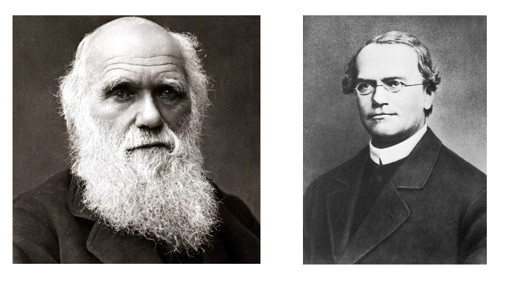
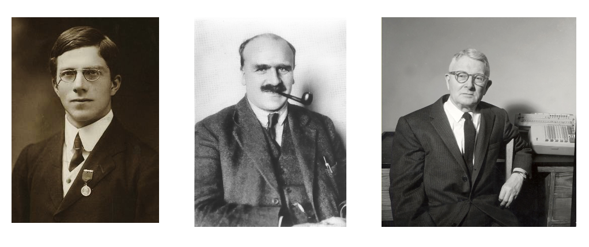
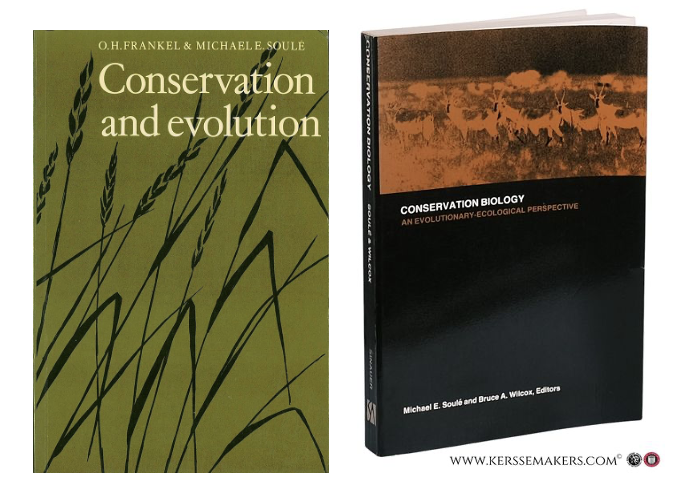

# A Brief History of Conservation Genetics

Conservation genetics is a relatively young discipline that merges population and evolutionary genetics with conservation biology. Perhaps more accurately described as subfield, its roots can be traced to Charles Darwin's (1809-1882) attempts to identify a source of the bountiful variation he observed in the natural world---variation essential for his theory of evolution by natural selection. Darwin was ultimately unsuccessful in this endeavor, and remained aware it was a major weakness until the end of his life. Inspired by plant and animal breeding, his observations of sudden discontinuous variation in livestock traits (such as the short legs of [Ancon or "Otter" sheep](https://en.wikipedia.org/wiki/Ancon_sheep)) initially led him to emphasize the role of "sports", or dramatic mutations.

Yet his acceptance of a mode of inheritance that blended parental traits together proved incompatible with the maintenance of sports from generation to generation. By 1868 he had shifted to a model of "gemmules"---atomic units of inheritance that individuals acquired through changes in their environment and passed on to their young. In doing so, he reasoned, adaptations could be maintained through time. Ultimately unconvincing to his peers, he died unaware that the monk Gregor Mendel had landed on a solution to his problem three years early through intensive study of pea plants: the inheritance of traits was particulate, and thus irreducible. Some genetic variants are dominant, some are recessive; genetic variants segregate during reproduction, and assort independently.

{width="60%"}

Mendel's framework lay the foundation for the work of the founding fathers of population genetics: Sewell Wright (1889 - 1988), Ronald Fisher (1890 - 1962), and J.B.S. Haldane (1892 - 1964). Wright, the sole North American of the bunch, and relatively well-behaved compared to his compatriots, studied animal breeding and made major contributions to our understanding of inbreeding and path analysis (now common in causal inference statistics). Fisher was a British polymath---arguably a genius---whose footprints on genetics and statistics are pervasive. Politically conservative, he was an outspoken eugenicist and by all accounts unpleasant to those close to him. J.B.S. Haldane, the most charismatic of the bunch, was also a widely read Brit. The son of a Scottish physician who conducted physiological experiments on his family, Haldane earned a degree in Classics, fought in World War I, become an avid communist who never disavowed Stalin, and eventually migrated to India. His influence is particularly strong on the mathematics of natural selection, as well as linkage and gene mapping.

Wright, Fisher, and Haldane were important actors in the Modern Synthesis of evolutionary biology. A term coined by British evolutionary biologist, science popularizer (and, again, eugenicist) Julian Huxley, its better known figures include the German American Zoologist Ernst Mayr, the Russian geneticist Theodosius Dobzhansky, and the paleontologist George Gaylord Simpson. Together, the group pioneered much of our current understanding of how evolution occurs within and across lineages. Their work was followed in the 1960s and 70s by scientists who formalized population genetics into the diverse and active field it is today. Important figures in this era included James Crow (of University of Wisconsin) and Motoo Kimura (of Kyoto Imperial University), who co-developed the neutral theory of molecular evolution; Richard Lewontin, who generated some of the first empricial genetic data on human populations, showing variation was far greater within ethnic groups than among them, and who used his expertise in service of deeply felt leftist ideals; and Brian and Deborah Charlesworth, a married couple from the UK with strong interests in recombination.

Conservation genetics *sensu strictu* emerged from this legacy in the late 1970s. Catalyzing events included a series of papers by Australian plant geneticist O.H. Frankel---who provacatively argued preserving genetic diversity was a moral responsibility and necessity to ensure continued evolution---his co-authored book with Michael Soulé entitled Conservation and Evolution, and Soulé's collaboration with Bruce Wilcox entitled *Conservation Biology: An Evolutionary-Ecological Perspective.* Soulé's involvement---a UC Santa Cruz-based ecologist and evolutionary biologist who can be given an enormous amount of credit for the development of the field of conservation biology more broadly---should indicate the close association between these applied, "crisis-driven" disciplines.

Since the 1980s, conservation genetics has benefited from astounding advances in our ability to collect marker data from across the genomes of individuals in wild populations, and concurrent advances in computational and statistical tools. For our purposes, it is interesting to note that several major figures in the field have been based in the Northwest or Montana. Joe Felsenstein---a theoretical population geneticist and phylogeneticist---trained with both Lewontin and Crow before ending up at University of Washington, where he eventually taught the author of this document courses in both subject areas. A much more notable Felsenstein student was Fred Allendorf, now emeritus faculty at University of Montana. Allendorf has made myriad contributions to conservation genetics, with a particular focus on salmonids; not coincidentally, Missoula and UM have become hubs for conservation genetics research, with Gordon Luikart and Mike Schwartz (of the US Forest Service's Rocky Mountain Research Station) running active and impactful labs. Back in Seattle, Robin Waples of NOAA has had a fruitful career using fisheries data to clarify outstanding issues in population genetics theory and practice.

{width="60%"}

In its current iteration, conservation genetics aims to delimit the basic units of biological conservation and understand how their genetic composition is affected by habitat loss, exploitation, and environmental change. There is a strong emphasis on what is unique about evolutionary processes in small populations; as genetic and genomic tools become easier to use, they are ever more frequently applied to non-evolutionary conservation questions (such as community metabarcoding). In this course, we will cover the following non-exhaustive list of topics:

-   How evolutionary processes impact genotype frequencies and allele frequencies;
-   How inbreeding is measured, and why it is harmful for reproduction and survival;
-   How genetic diversity is lost and why it affects evolutionary potential;
-   How fragmenting populations and habitat impacts gene flow, and what this means for diversity;
-   How small populations end up evolving more by random processes (genetic drift) than by deterministic processes (natural selection);
-   How mutations are accumulated and lost, and what their likely impacts are;
-   How we determine taxonomy and management units using genetic data;
-   How outcrossing (mating with distant relatives) can impact the fitness of populations. 

As discussed in the Preface, my bias is towards foundational evolutionary genetics theory, with conservation-minded empirical examples. Much of the start of Frankham, Ballou, and Briscoe's *Introduction to Conservation Genetics* lays out the broader justification for conservation biology. Note that much of this field is shaped by values, ethics, and policy—--not just science. The field is mission-driven, but can't tell us what we must do, just provide evidence of most effective way to pursue a particular societally desired goal.

::: {.callout-note collapse="true" title="Foundational genetics vocabulary and concepts"}
**Mendel's Law of Dominance and Uniformity**\
Some alleles are dominant while others are recessive; an organism with at least one dominant allele will display the effect of the dominant allele.

**Mendel's Law of Segregation**\
During gamete formation, the alleles for each gene segregate from each other so that each gamete carries only one allele for each gene.

**Mendel's Law of Independent Assortment**\
Genes of different traits can segregate independently during the formation of gametes.

**Darwin's Theory of Natural Selection**\
Variation of traits, both genotypic and phenotypic, exists within all populations of organisms. However, some traits are more likely to facilitate survival and reproductive success. Thus, these traits are passed onto the next generation. These traits can also become more common within a population if the environment that favors these traits remains fixed.

**Gene**\
The basic unit of heredity *or* a sequence of nucleotides that is transcribed.

**Locus**\
A specific, fixed position on a chromosome.

**Allele**\
A variant in the sequence of nucleotides at a particular locus.

**Genotype**\
The complete set of alleles an organism carries.

**Genome**\
All the genetic information of an organism.

**Phenotype**\
The set of observable characteristics or traits of an organism.

**Ploidy**\
The number of complete sets of chromosomes in a cell.

**Diploid**\
The state of having two homologous copies of each chromosome.

**Homozygote**\
The state of having identical alleles at the same locus on homologous chromosomes.

**Heterozygote**\
The state of having different alleles at the same locus on homologous chromosomes.

**Dominant**\
An allele whose effect masks or overrides the effect of a different allele at the same locus.

**Recessive**\
An allele whose effect is masked by a dominant allele.

**Chromosome**\
A package of DNA with some or all of the genetic material in an organism. In most chromosomes, thin DNA fibers are coated with packaging proteins to form nucleosomes (histones in eukaryotes), which bind and condense DNA to protect it, generating a complex 3D structure.

**DNA**\
A polymer composed of two polynucleotide chains that coil around each other to form a double helix. The polymer carries genetic instructions for the development, functioning, growth, and reproduction of all known organisms and many viruses.

**Central Dogma**\
“DNA makes RNA, and RNA makes protein.” DNA is transcribed to RNA by RNA polymerase, and RNA is translated into protein by ribosomes.

**Nucleotide**\
An organic molecule composed of a nitrogenous base, a pentose sugar, and a phosphate. Nucleotides are the monomeric units of nucleic acids—DNA and RNA.

**A, C, T, G**\
Adenine, cytosine, thymine, and guanine. Adenine and guanine are purines (two rings); cytosine and thymine are pyrimidines (one ring). A pairs with T, and C pairs with G.

**Protein**\
A biomolecule composed of one or more amino acids.

**Amino acid**\
An organic compound containing both amino and carboxylic acid functional groups; incorporated into proteins.

**Enzyme**\
A protein that acts as a biological catalyst.

**Active site**\
The region of an enzyme where substrate molecules bind and undergo a chemical reaction.

**Allele frequency**\
The proportion of chromosomes with a particular allele at a particular locus in a population.

**Genotype frequency**\
The proportion of individuals with a particular set of alleles at a particular locus in a population.

**Monomorphic**\
Only one form; invariant.

**Polymorphic**\
Many forms; variable.

**Diagnostic locus**\
A locus at which all individuals of a particular population or species carry the same allele; can be used for identification.
:::

::: {.callout-note collapse="true" title="Foundational statistics vocabulary and concepts"}
**Parameter**\
A quantity that summarizes or describes an aspect of a *population*, such as a mean or standard deviation.

**Statistic**\
A quantity computed from sample data for a statistical purpose; describes a *sample*.

**Confidence interval**\
An interval that is expected to contain the true population parameter with a specified level of confidence.

**Null hypothesis**\
The hypothesis that no relationship exists between variables being analyzed.

**p-value**\
The probability of obtaining test results at least as extreme as the observed result, assuming the null hypothesis is true. A very small p-value indicates that the observed outcome would be unlikely under the null hypothesis (but does *not* mean the alternative hypothesis is correct).

**Normal distribution**\
A continuous probability distribution in which values are symmetrically distributed around the mean.

$R^2$\
The proportion of variation in the dependent variable that is predictable from the independent variable(s).

**Degrees of freedom**\
The number of values in the final calculation of a statistic that are free to vary.
:::
