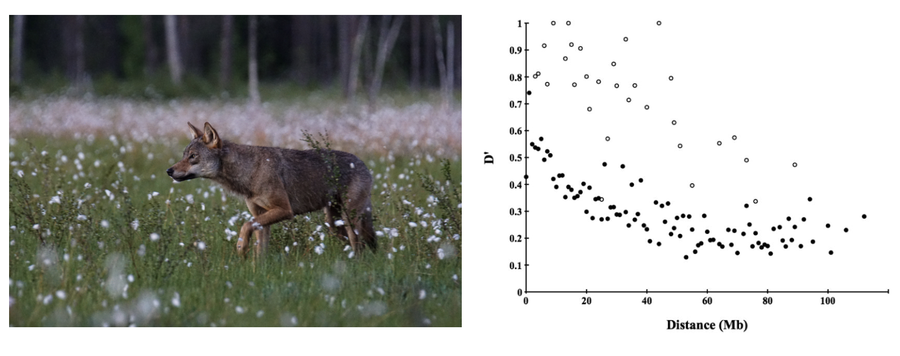
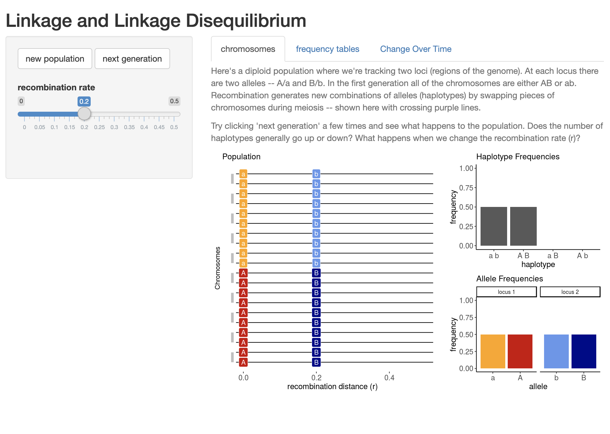

### Linkage Disequilibrium 

Hardy-Weinberg Proportions give us expectations for the frequency of genotypes at a locus. We now know this is useful and interesting because it provides a null model for patterns in the absence of a variety of biological processes of interest: mutation, selection, gene flow, and the stochastic consequences of finite population sizes. But what should we expect between different alleles at two independently assorting loci? In other words, if two loci are located on different chromosomes, or so far apart on the same chromosome that recombination during meiosis is highly probable, what is the expected frequency distribution of pairs of alleles in the next generation? 

This question is the basis of concept of **linkage disequilibrium**, typically measured by the metric $D$. Consider diallelic loci $A$ and $B$, with alleles $A_1$ and $A_2$ and $B_1$ and $B_2$. How often should we expect the gamete (or haplotype) $A_1B_1$ versus $A_1B_2$ versus $A_2B_2$ versus $A_1B_1$? If these loci are completely independent—say, on different chromosomes—we expect a given combination to be the product of its frequencies: 

$$
f(A_1B_1) = f(A_1)*f(B_1)
$$

To measure $D$, we compare this expected, *unlinked* haplotype frequency to the actual data. For example, imagine we survey a population of N=8 individuals and count the following haplotypes (at 2N = 16 chromosomes): 6 $A_1B_1$s (= 6/16 = 0.375), 2 $A_1B_2$s (= 2/16 = 0.125), 6 $A_2B_2$s (= 6/16 = 0.375), 2 $A_2B_1$s (= 2/16 = 0.125). Based on these data, we know that the overall frequency of $A_1$ is $f(A_1)=0.5$. Necessarily, $f(A_2)=0.5$. Likewise, the frequency of $B_1$ is 8/16=0.5 and $f(B_2)$=0.5. 

$D$ is simply the difference between the observed frequency of a particular haplotype and our expectation of it:  

$$
D(A_1B_1) = f(A_1B_1) -f(A_1)f(B_1) = 0.375 - (0.5*0.5) = 0.125
$$

Contrast this with a hypothetical situation in which all four possible haplotypes are found at equal frequencies (i.e. $f(A_1B_1)=f(A_1B_2)=f(A_2B_2)=f(A_2B_1)=0.25$): 

$$
D(A_1B_1) = f(A_1B_1) -f(A_1)f(B_1) = 0.25 - (0.5*0.5) = 0
$$

This comparison tells us two things. First, a positive $D$ value means that the two alleles at different loci used to calculate its value are occuring together *more often* than we would expect if assortment is truly independent. A negative value would therefore indicate two alleles occur together *less often* than we would expect. Second, a value of $D=0$ is our expectation if there is no linkage disequilibrium. 

Importantly, we will get the same *absolute* value of $D$ no matter which pair of alleles we choose: 

$$  
D(A_1B_1) = f(A_1B_1) -f(A_1)f(B_1) = 0.375 - (0.5*0.5) = 0.125
$$
$$
D(A_1B_2) = f(A_1B_2) -f(A_1)f(B_2) = 0.125 - (0.5*0.5) = -0.125
$$
$$
D(A_2B_2) = f(A_2B_2) - f(A_2)f(B_2) = 0.375 - (0.5*0.5) = 0.125
$$
$$
D(A_2B_1) = f(A_2B_1) -f(A_2)f(B_1) = 0.125 - (0.5*0.5) = -0.125  
$$  

It follows that the maximum value of $D$ is |0.25| (when a pair of alleles are *always* or *never* inherited together). 

So what causes this non-random assortment of alleles? Physical linkage—the close proximity of two loci on the same chromosome—is one possibility. But LD can also be caused by interactions between genes, natural selection, population genetic structure, and demographic history. For example, speciation can be caused by incompatible allele combinations (a phenomenon known as negative epistasis). If inheriting $A$ and $b$ leads to fertility and health, but inheriting $A$ and $B$ results in infertility and death, the allelic combination $A$ and $B$ will disappear from the population. Natural selection can similarly favor particular allele combinations at different loci that impact traits that are functionally integrated, increasing their frequency above random expectations. And when all members of a species are not equally likely to interbreed, but instead randomly mate within distinct populations with distinct allele frequencies, assaying genotypes from multiple demes at once will produce elevated $D$ values even in the absence of other LD-generating processes. 

It should be clear this is a bad name for a complicated phenomenon (in a field full of bad names)—--neither solely due to linkage, nor really a disequilibrium (frequencies of haplotypes can be stable through time). The term **gametic disequilibrium** has been proposed as an alternative, but has yet to reach a critical mass of use in the field. 

### LD Decay

Recombination between loci will break down $LD$ through time in most cases, a relationship described by $D^t = D_0(1 - c)^t$, where $D^t$ is linkage disequilibrium at generation $t$, $D_0$ is the initial value of linkage disequilibrium, and $c$ is the recombination rate. (*c* is usually expressed as centimorgans per megabase, where 1 centimorgan is equivalent a 1% chance two loci on a chromosome will become separated from one another as a result of recombination during meiosis. A megabase is simply one million nucleotide bases.)

We can plot this relationship for a set of arbitrary recombination rate values as follows: 

```{r, message=FALSE, width=3, height=3, warning=FALSE}
library(ggplot2)

# assign different values of c and D_0
c1 <- 0.01
c2 <- 0.10
c3 <- 0.25
D_0 = 0.25

# assign functions for each value of c
ld_1 <- function(x) D_0*(1 - c1)^x
ld_2 <- function(x) D_0*(1 - c2)^x
ld_3 <- function(x) D_0*(1 - c3)^x

# generate plot
p1 <- ggplot() +
  theme_bw() +
  theme(legend.title = element_blank())+
  stat_function(fun = ld_1, aes(linetype="c=0.01")) +
  stat_function(fun = ld_2, aes(linetype="c=0.1")) +
  stat_function(fun = ld_3, aes(linetype="c=0.5")) +
  scale_linetype_discrete() +  
  ylim(0,0.25) +
  xlim(0, 500) +
  ylab("Linkage Disequilibrium (D)")
p1
```


::: {.callout-note title="Linkage Disequilibrium in Scandinavian Wolves"}

Gray wolves (*Canis familiaris*) in Scandinavia underwent a severe population bottleneck: after local extirpation in the middle of the 20th century, a single pair of immigrant wolves from the Finnish / Russian border eventually resettled central Sweden and began to reproduce. This pair and a third immigrant male arriving a decade or so later were the sole founders of a population that was estimated at 150 individuals in 18 packs in 2009. Because nearly all mating events in subsequent generations involved close relatives, Scandinavian wolves are highly inbred. Hagenblad et al. [@hagenblad2009population] genotyped wolves from this population at 250 microsatellite markers with a known location in the canine genome. They found linkage disequilibrium values (measured by $D'$) extended long physical distances---exactly what you would expect if genetic drift as a result of extremely small population sizes led to nonrandom associations among loci. 



:::

:::{.callout-note title="LDSim Activity"}

[CJ Battey's LDSim](https://cjbattey.shinyapps.io/LDsim/) is a useful application to understand linakge disequilibrium more intuitively. 



Open the app in your browser and consider the following two questions: 

1) Under the "Chromosomes" tab, look at the plot that appears when the website loads. What is the x axis? What does each horizontal line represent? What do the gray bars pairing horizontal lines represent? How about the colors?

2) Using the same "Chromosomes" tab, move the "recombination rate" slider to 0, then click "Next Generation" several times. What happens to haplotype and allele frequencies? Click "New Population" to reset, and change the recombination rate to a higher value and repeat the simulation. How does your answer change? 

3) Navigate to the "Change Over Time" tab and click "Run". What does the graph that appears below the sliders show? Describe all features.  

4) Under the "Change Over Time" tab, run simulations using different combinations of recombination rate and population size. Which values lead to the quickest loss (or "decay") in LD? Which values lead to the slowest?  

5) Develop a question that can be answered using this app. 

:::


