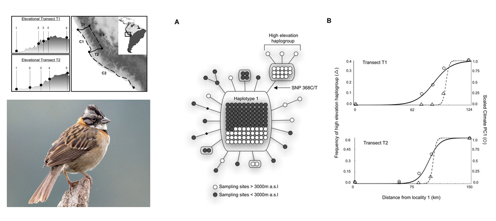

## Mutation, migration, and selection

Next, we incorporate mutation. Selection more or less inevitably act on the new mutations that are being continuously added to populations as the majority are deleterious (it's much easier to break something than improve it!). Intuitively, the overall change in the frequency of $q$ will be equal to its change due to mutation and its change due to selection—a phenomenon known as **mutation-selection equilibrium**, or the balance between the addition of deleterious alleles by mutation and their removal by selection. For a deleterious recessive allele, this is: :

$$
\Delta q = \Delta q_{mutation} + \Delta q_{selection} 
$$ Assuming a model of simple dominance, we know that deleterious mutations increase as a product of their forward mutation rate ($u$) and frequency ($p$), and decrease at rate determined by the one locus selection models we covered last week ($\frac{-spq^2}{1-spq^2}$). Therefore:

$$
\Delta q = up - \frac{spq^2}{1-sq^2}
$$

Since $sq^2$ is an incredible small quantity for rare alleles, the denominator is essentially 1, so

$$
\Delta q = up - spq^2
$$

By definition, an equilibrium is when inputs (mutations) match outputs (alleles to selection) ($\Delta q = 0$). When this is true, $up \sim  spq^2$. We can divide both sides of the similarity by $sp$ to isolate $q^2$:

$$
0 \sim up + spq^2; \text{  } up \sim spq^2; \text{  } \frac{up}{sp} =  \frac{u}{s} \sim q^2
$$ We then take the square root of the right side of the equation to derive the equilibrium frequency of $A_{2}$:

$$
\hat{q} \sim \sqrt{\frac{u}{s}}
$$ In plain English, the equilibrium frequency of $q$ will be the square root of the ratio of mutation from $A_1$ to $A_2$ to mutation from $A_2$ to $A_1$. We further know that:

-   The equilibrium only depends on the mutation rate and the selection coefficient
-   Increased mutation rates will increase the frequency of $A_2$
-   Increased strength of selection against it will decrease it.

Here are two simple examples of the use of this equation:

Q: What is the mutation-selection equilibrium for a recessive lethal allele if the forward mutation rate is 3 x $10^{-5}$?

A:

$$
q \sim \sqrt{\frac{3 x 10^{-5}}{1}} \sim 0.0054
$$

Q: What is the mutation-selection equilibrium for a recessive deleterious allele if the forward mutation rate is 1 x $10^{-5}$ and the selection coefficient is 0.1?

A:

$$
q \sim \sqrt{\frac{3 x 10^{-5}}{0.1}} \sim 0.017
$$

In the same vein, we can model the counteracting forces of migration and selection to predict allele frequencies at **migration-selection equilibria**. (Because mutation is rare and only changes allele frequencies very slowly, this will be more important for most scenarios discussed in class). The change in the frequency of allele $q$ is going to be determined by the proportion of alleles in a population of interest that are contributed by migrants, a variable we call $m$, multiplied by the difference in the frequency of $q$ in the migrant population and the local population:

$$
\Delta q = m(q_m - q_0)  
$$

For example, if migrants are fixed (homogenous) for an allele that is absent from the focal population, and contribute 20% of alleles to the focal population, we expect a change in $q$ of +0.2 in a single generation:

$$
\Delta q = 0.2(1 - 0) = 0.2  
$$

By similar logic, the frequency of $q$ in the generation 1 ($q_1$) will be the sum of the product of $m$ and $q_m$ and the initial frequency of $q$ and the proportion of alleles that are NOT migrants, which simplifies to the intial allele frequency plus the migration rate multiplied by the difference betwen the frequency of $q$ in the migrant population and focal population:

$$
q_1 = (1 -m)q_0 + mq_m  = q_0 - mq_0 + mq_m = q_0 + m(q_m - q_0)
$$

This gives us the basis for the derivation of $\Delta q$ above:

$$
\Delta q = q_1 - q_0 =(q_0 + m(q_m - q_0)) - q_0 = m(q_m - q_0)
$$

As an example of its application, imagine a scenario in which we wish to estimate the migration rate of domestic dog alleles into a wild dog population. We will consider a locus that is *diagnostic* (fixed in one species or population and not the other), treat the new, hybrid population as $q_0$, $q_1$ as the initial allele frequency of "pure" wild dogs, and $q_m$ as the allele frequency of domestic dogs:

|          |       |      |
|:---------|:------|:-----|
| wild dog | $q_0$ | 1    |
| hybrid   | $q_1$ | 0.78 |
| dog      | $q_m$ | 0    |

To do this need to isolate $m$ from $q_1 = q_0 + m(q_m - q_0)$:

$$
q_1 = q_0 + m(q_m - q_0)\\
q_1 - q_0 = m(q_m - q_0)\\
\frac{q_1 - q_0}{q_m - q_0} = m\\
m = \frac{0.78 - 1}{0 - 1} = 0.22
$$

If migration and selection form an equilibrium allele frequency, what is it? This question is relevant to the analysis of clines and hybrid zones. We again consider the overall change in $q$ to be the sum of the change in $q$ due to opposing forces:

$$
\Delta q = \Delta q_{selection} + \Delta q_{migration} 
$$

::: {.callout-note title="Migration-Selection Equilibrium in *Zonotrichia capensis*"}
Populations that are continuously distributed across environmental gradients are likely to experience migration-selection equilibrium because adjacent individuals---that are otherwise free to interbreed---may be under selection from different abiotic or biotic factors. The predictable reduction in the partial pressure of oxygen ($PO_2$) with increasing elevation exerts strong selection on respiratory function in endotherms, leading to a suite of adaptations to hypoxia in high mountains. Zac Cheviron and Rob Brumfield (@cheviron2009migration) asked how gene flow and selection interacted to shape allele frequencies in mitochondrial and nuclear DNA in the widespread Rufous-collared Sparrow (*Zonotrichia capensis*). Sampling across multiple elevational gradients and a horizontal "control" transect, they found a clinal change in the frequency of a haplogroup (= group of similar haploid DNA sequences) that reached fixation at high elevations. They found no detectable pattern at nuclear loci, suggesting gene flow homogenizes allele frequencies at most loci across the gradients, while selection acts on proteins encoded in the mitochondria across elevation (but not within elevational bands).

:::
