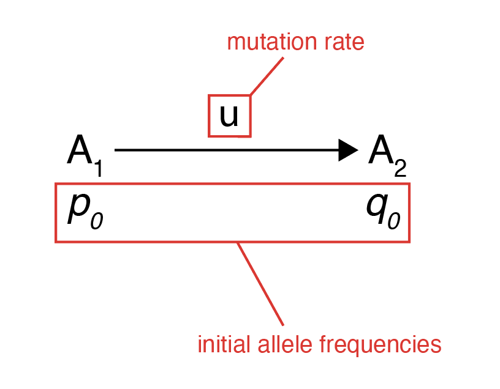
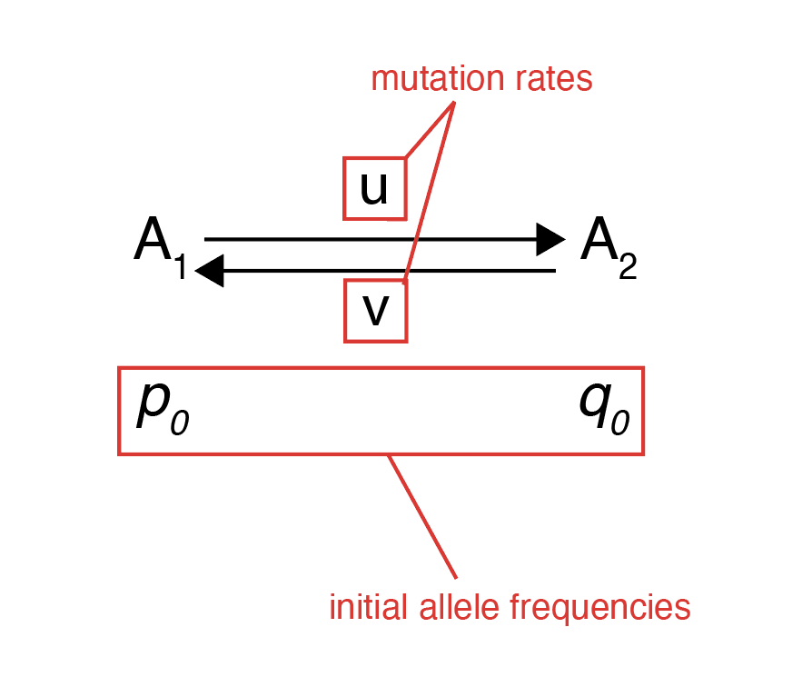
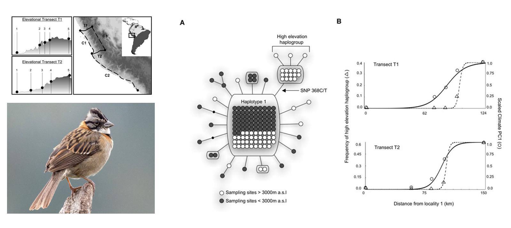

The next violation of HWP assumptions we will examine is mutation. Mutations are a sudden genetic change in an allele or chromosome. They can be caused by the impacts of oxygen, radiation, chemicals, or cellular processes. DNA repair fixes many mutations but is imperfect. Importantly, mutations are the origin of all genetic diversity. 

Common types of mutations include: 

- Base substitutions
- Additions or deletions in DNA sequences
- Gene duplications
- Insertion of mobile DNA elements (**transposons**)

While we often think of mutations as inherently negative, they can have a variety of fitness effects: 

- **silent substitutions**: a mutation in a coding region that does not result in an amino acid substitution in a protein
- **neutral mutations**: mutations with little to no impact on fitness
- **deleterious mutations**: mutations that negatively impact fitness
- **beneficial mutations**: mutations that positively impact fitness

Importantly, some mutations may be beneficial in some circumstances but not others!

A key parameter for a given mutation type is its rate, typically denoted by $u$ or $\mu$ ("myu"). Mutation rates describe the probability of mutation per unit per generation. Different genetic markers have different rates. As a set of benchmarks: 

- 1 x $10^{-8}$ to 1 x $10^{-9}$ per base per year: DNA nucleotides
- mammalian mtDNA typically has 5 - 10x the nuclear DNA mutation rate
- 1 x $10^{-4}$ per locus: mammalian microsatellites
- 1 x $10^{-5}$ per locus: morphological mutations in fruit flies

For example, a per nucleotide rate of $10^{-5}$ (equivalent to $\frac{1}{100000}$) leads us to expect a single mutation in a stretch of 100,000 bases each generation (because the independent probabilities of mutation at each base are summed). If instead our mutation rate is per *gene* and we know there are roughly 20,000 genes in the human genome, we would expect $10^{-5} * 20,000 = 0.2$ mutations per individual (so, roughly every 5 individuals we'll find one new mutation in a coding region).

The probability of an individual NOT having a mutation in one of their 20,000 genes is a little more complicated. To determine it, we need to account for both the probability of no mutation in their maternally-inherited chromosomes and the probability of no mutation in their paternally inherited chromosomes. Each haploid genome requires multiplying the independent probability of NO mutation ($=1-\mu$) by itself 20,000 times, as these independently probabilities must occur concurrently. We then must multiply the probabilities of no mutation in each haploid genome by each other, as these two events must also occur together: 

$$
p(\text{no mutation}) =  (1-\mu)^{20000} + (1-\mu)^{20000} = (1-\mu)^{40000} = (1-\frac{1}{100000})^{40000} \sim 0.67
$$

Conversely, to find the probability of at least one new mutation in a coding region in a human's diploid genome, we can either take the complement of no mutation (i.e., $1-0.67=0.23$). 

But what does this mean for allele frequencies? We start with a simple model where allele $A_1$ (occuring at frequency $p_0$) mutates to become $A_2$ (occuring at frequency $q_0$) at rate $u$ / $\mu$. (For now, we assume mutation is only one-dimensional.) 

{width=50%}

The frequency of $A_1$ in the next generation ($p_1$) will be its initial frequency multiplied by the complement of the mutation rate, i.e. the expected proportion of alleles that do NOT mutate:  

$$
p_1 = p_0(1 - \mu)
$$

We can use this formula in the following example: 

Q: What is the frequency of allele $A_{1}$ in the next generation if its mutation rate $u$ is 2.5 x $10^{-5}$ and it occurs at an initial frequency of 0.7?

A: 

$$
p_{1} = p_{0}(1 - u);  
$$
$$
p_{1} = 0.7(1 - 0.000025);  
$$

$$
p_{1} = 0.6999825  
$$

This shows us that among other things, mutation is a *slow* way to change allele frequencies and restore genetic diversity!

This same model helps us determine the change in $A_1$ from generation to generation: it is the difference between $p_1$ and $p_0$, which simplifies to the negative product of the mutation rate and initial frequency of $A_1$: 

$$
\Delta p = p_1 - p_0 = p_0(1 - \mu) - p_0 = p_0 - \mu p_0 - p_0 = -\mu p_0
$$

We can also use this relationship to build a model of how mutation changes allele frequencies $t$ generations in the future. If $p_1 = p_0(1 - \mu )$, then $p_2 = p_1(1 - \mu ) = p_0(1 - \mu)*(1 - \mu) = p_0(1 - \mu)^2$. Therefore, $p_t = p_0(1 - \mu)^t$, which means that $p_t \sim p_0e^{-\mu t}$. (This equation is an approximation of exponential decay.)  

An immediate application of our model is to address the question of how long it takes for mutation to restore lost genetic diversity. We can do this by isolating $t$ in the equation above:  

$$
p_t \sim p_0e^{-\mu t}
$$
$$
\frac{p_t}{p_0} = e^{-\mu t}
$$
$$
ln(\frac{p_t}{p_0}) = -\mu t
$$
$$
\frac{ln(\frac{p_t}{p_0})}{-\mu } = \frac{ln(p_t)-ln(p_0)}{-\mu} = \frac{-ln(p_0)-ln(p_t)}{\mu} = t
$$
We can apply this equation if (for example) we have a mutation rate of $10^{-6}$ and want to know how long it takes for $p$ to go from a frequency of 1 to 0.9: 

$$
 \frac{-ln(1)-ln(0.9)}{10^{-6}} = t = 105,360\text{ generations}
$$

{width=50%}

But what happens if we have mutation in two directions? In this model, allele $A_1$ (occuring at frequency $p_0$) still mutates to become $A_2$ (occuring at frequency $q_0$) at rate $u$, but we also permit $A_2$ to mutate back to $A_1$ at rate $v$:  

In this scenario, we would expect the equilibrium frequency of each allele to be determined by the relative strength of mutation in each direction:

$$
\hat{p} = \frac{v}{\mu+v};\text{   } \hat{q} = \frac{\mu}{u+v}
$$

For example: what is the equilibrium frequency of $A_2$ if $\mu=10^{-5}$ and $v=3*10^{-6}$?

$$
\hat{q} = \frac{10^{-5}}{10^{-5}+(3*10^{-6})} = 0.77
$$

## Mutation, migration, and selection

Next, we incorporate mutation. Selection more or less inevitably acts on the new mutations that are being continuously added to populations as the majority are deleterious (it's much easier to break something than improve it!). Intuitively, the overall change in the frequency of $q$ will be equal to its change due to mutation and its change due to selection—a phenomenon known as **mutation-selection equilibrium**, or the balance between the addition of deleterious alleles by mutation and their removal by selection. For a deleterious recessive allele, this is: :

$$
\Delta q = \Delta q_{mutation} + \Delta q_{selection} 
$$ Assuming a model of simple dominance, we know that deleterious mutations increase as a product of their forward mutation rate ($u$) and frequency ($p$), and decrease at rate determined by the one locus selection models we covered last week ($\frac{-spq^2}{1-spq^2}$). Therefore:

$$
\Delta q = \mu p - \frac{spq^2}{1-sq^2}
$$

Since $sq^2$ is an incredible small quantity for rare alleles, the denominator is essentially 1, so

$$
\Delta q = \mu p - spq^2
$$

By definition, an equilibrium is when inputs (mutations) match outputs (alleles to selection) ($\Delta q = 0$). When this is true, $up \sim  spq^2$. We can divide both sides of the similarity by $sp$ to isolate $q^2$:

$$
0 \sim \mu p + spq^2; \text{  } \mu p \sim spq^2; \text{  } \frac{\mu p}{sp} =  \frac{\mu}{s} \sim q^2
$$ We then take the square root of the right side of the equation to derive the equilibrium frequency of $A_{2}$:

$$
\hat{q} \sim \sqrt{\frac{\mu}{s}}
$$ In plain English, the equilibrium frequency of $q$ will be the square root of the ratio of mutation from $A_1$ to $A_2$ to mutation from $A_2$ to $A_1$. We further know that:

-   The equilibrium only depends on the mutation rate and the selection coefficient
-   Increased mutation rates will increase the frequency of $A_2$
-   Increased strength of selection against it will decrease it.

Here are two simple examples of the use of this equation:

Q: What is the mutation-selection equilibrium for a recessive lethal allele if the forward mutation rate is 3 x $10^{-5}$?

A:

$$
q \sim \sqrt{\frac{3 x 10^{-5}}{1}} \sim 0.0054
$$

Q: What is the mutation-selection equilibrium for a recessive deleterious allele if the forward mutation rate is 1 x $10^{-5}$ and the selection coefficient is 0.1?

A:

$$
q \sim \sqrt{\frac{3 x 10^{-5}}{0.1}} \sim 0.017
$$

In the same vein, we can model the counteracting forces of migration and selection to predict allele frequencies at **migration-selection equilibria**. (Because mutation is rare and only changes allele frequencies very slowly, this will be more important for most scenarios discussed in class). The change in the frequency of allele $q$ is going to be determined by the proportion of alleles in a population of interest that are contributed by migrants, a variable we call $m$, multiplied by the difference in the frequency of $q$ in the migrant population and the local population:

$$
\Delta q = m(q_m - q_0)  
$$

For example, if migrants are fixed (homogenous) for an allele that is absent from the focal population, and contribute 20% of alleles to the focal population, we expect a change in $q$ of +0.2 in a single generation:

$$
\Delta q = 0.2(1 - 0) = 0.2  
$$

By similar logic, the frequency of $q$ in the generation 1 ($q_1$) will be the sum of the product of $m$ and $q_m$ and the initial frequency of $q$ and the proportion of alleles that are NOT migrants, which simplifies to the intial allele frequency plus the migration rate multiplied by the difference betwen the frequency of $q$ in the migrant population and focal population:

$$
q_1 = (1 -m)q_0 + mq_m  = q_0 - mq_0 + mq_m = q_0 + m(q_m - q_0)
$$

This gives us the basis for the derivation of $\Delta q$ above:

$$
\Delta q = q_1 - q_0 =(q_0 + m(q_m - q_0)) - q_0 = m(q_m - q_0)
$$

As an example of its application, imagine a scenario in which we wish to estimate the migration rate of domestic dog alleles into a wild dog population. We will consider a locus that is *diagnostic* (fixed in one species or population and not the other), treat the new, hybrid population as $q_0$, $q_1$ as the initial allele frequency of "pure" wild dogs, and $q_m$ as the allele frequency of domestic dogs:

|          |       |      |
|:---------|:------|:-----|
| wild dog | $q_0$ | 1    |
| hybrid   | $q_1$ | 0.78 |
| dog      | $q_m$ | 0    |

To do this need to isolate $m$ from $q_1 = q_0 + m(q_m - q_0)$:

$$
q_1 = q_0 + m(q_m - q_0)\\
q_1 - q_0 = m(q_m - q_0)\\
\frac{q_1 - q_0}{q_m - q_0} = m\\
m = \frac{0.78 - 1}{0 - 1} = 0.22
$$

If migration and selection form an equilibrium allele frequency, what is it? This question is relevant to the analysis of clines and hybrid zones. We again consider the overall change in $q$ to be the sum of the change in $q$ due to opposing forces:

$$
\Delta q = \Delta q_{selection} + \Delta q_{migration} 
$$

::: {.callout-note title="Migration-Selection Equilibrium in *Zonotrichia capensis*"}
Populations that are continuously distributed across environmental gradients are likely to experience migration-selection equilibrium because adjacent individuals---that are otherwise free to interbreed---may be under selection from different abiotic or biotic factors. The predictable reduction in the partial pressure of oxygen ($PO_2$) with increasing elevation exerts strong selection on respiratory function in endotherms, leading to a suite of adaptations to hypoxia in high mountains. Zac Cheviron and Rob Brumfield (@cheviron2009migration) asked how gene flow and selection interacted to shape allele frequencies in mitochondrial and nuclear DNA in the widespread Rufous-collared Sparrow (*Zonotrichia capensis*). Sampling across multiple elevational gradients and a horizontal "control" transect, they found a clinal change in the frequency of a haplogroup (= group of similar haploid DNA sequences) that reached fixation at high elevations. They found no detectable pattern at nuclear loci, suggesting gene flow homogenizes allele frequencies at most loci across the gradients, while selection acts on proteins encoded in the mitochondria across elevation (but not within elevational bands).

:::
