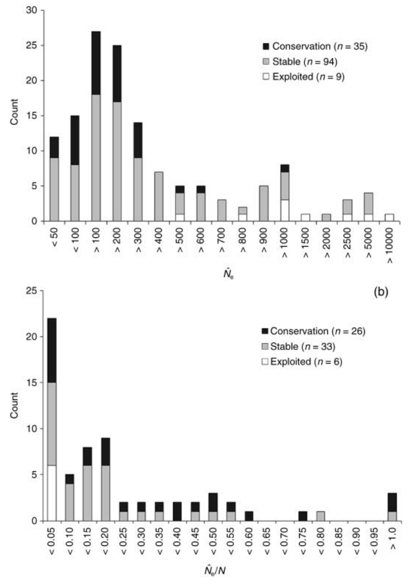

# Effective Population Size

One of the most important (and confusing) topics in population genetics, effective population size (denoted $N_e$) refers to the size of an ideal population that loses heterozygosity at the same rate as the observed population. Effective population size differs from census population size ($N$, i.e., the number of individuals you can count) due to fluctuations in population size, variation in family size, and overlapping generations. $N_e/N$ ratios are typically very low, with 0.1 being a good estimate in the absence of any other information. (Up until this point, all our models have been implicitly using $N_e$! We'll be careful to clarify this in the future.)

Because in a randomly-mating population, heterozygosity (technically expected heterozygosity, or $H_e$) is the probability two alleles are different, this population-wide increase in identity-by-descent (i.e., homozygosity) of $1/2N$ each generation reduces $H$ proportionally:

$$
H_1 = (1 - \frac{1}{2N})H_0
$$

(Here, $H_0$ is the population's initial expected heterozygosity, while $H_1$ is the heterozygosity of the next generation.) Though we will not focus on it in this class, the loss of genetic diversity (as measure by $H_e$, or the probability two randomly drawn alleles are different) will vary across modes of inheritance: $\frac{1}{N_e}$ for haploid organisms, $\frac{1}{4N_e}$ for tetraploids, $\frac{1}{1.5N_e}$ for sex chromosomes, $\frac{1}{N_{ef}}$ for mitochondrial DNA (which is maternally inherited—thus the subscript $f$). This tells us rates of genetic diversity loss will be greater in haploid than tetraploid organims, and in mtDNA than in sex chromosomes.

We can use the general relationship for diploid organisms above to predict the expected heterozygosity $t$ generations in the future, which should take on a familiar form:

$$
H_1 = (1 - \frac{1}{2N})H_0
$$ $$
H_2 = (1 - \frac{1}{2N})H_1 = (1 - \frac{1}{2N})*(1 - \frac{1}{2N})H_0
$$ $$
H_2 = (1 - \frac{1}{2N})^2H_0
$$ $$
\frac{H_2}{H_0} = (1 - \frac{1}{2N})^2
$$ $$
\frac{H_t}{H_0} = (1 - \frac{1}{2N})^t
$$ $$
H_t \sim e^{\frac{-t}{2N}}
$$ Heterozygosity thus decays exponentially at a rate determined by the effective population size.

We can apply this equation to determine the remaining heterozygosity at a particular time given initial heterozygosity and the (effective) number of individuals in the population. For example, if initial heterozygosity is 0.6, our population size is 50, and we are interested in the heterozgosity remaining at generation $t=20$:

$$
H_t = 0.6e^{\frac{-20}{2*50}} = 0.4912
$$

To determine the effective population size required to maintain a particular level of heterozygosity in the population, we can isolate the variable $N$ using the natural logarithm. Let's say we want to figure out the minimum population size required to maintain 40% of heterozygosity over 10 years:

$$
0.40 = \frac{H_t}{H_0} = (1 - \frac{1}{2N_e})^{10} \sim e^{\frac{-10}{2N_e}}
$$ $$
ln(0.40) = \frac{-10}{2N_e}
$$ $$
ln(0.40) = \frac{-10}{2N_e}
$$ $$
ln(0.40)*2N_e = -10
$$ $$
2N_e = \frac{-10}{ln(0.40)}; Ne = \frac{-5}{ln(0.30)} = 5.45
$$ As mentioned above, effective population size will be impacted by factors like variation in the size of successive generations, fluctuating population size, and unequal sex ratios. The amount of heterozygosity retained over $t$ generations will be the product of the effective population size in each:

$$
\frac{H_t}{H_0}=\prod_i^t(1-\frac{1}{2N_{ei}})
$$

For three populations of size 10, 500, and 200, this would be:

$$
\frac{H_t}{H_0}=\prod_i^t(1-\frac{1}{2N_{e_i}})=(1-\frac{1}{20})(1-\frac{1}{1000})(1-\frac{1}{400})=0.947
$$ For fluctuating population sizes, $N_e$ is calculated as a the harmonic mean of the population size at each of $t$ timesteps:

$$
N_e = \frac{1}{\frac{1}{t}\sum_i^t\frac{1}{N_i}}
$$ Because the harmonic mean is more heavily impacted by small quantities than the arithmetic mean, $N_e$ will be shaped by the minimum population sizes through time (which makes sense, given these miniature bottlenecks will lead to the biggest losses of heterozygosity).

It's worth looking at the derivation of effective population size under unequal sex ratios in detail. We'll start by considering the probability two alleles from different females are IBD from a female ancestor. This is equivalent to determining the loss of heterozygosity in females alone, and should be $\frac{1}{4}\frac{1}{2N_{f}}$. Here, $\frac{1}{4}$ refers to the probability ($FF$ out of the possible combinations $FF$, $FM$, $MF$, and $MM$) both of selected individuals are females, while $\frac{1}{2N_{f}}$ refers to the probability the alleles are IBD in a female ancestor (this the numerator invoves the number of females—$N_f$—not overall population size). The loss of heterozygosity in males alone will have an identical form, giving us an overall expected loss of heterozygosity per generation given an unequal sex ratio:

$$
\frac{1}{2N_e} = \frac{1}{4}\frac{1}{2N_{f}} +  \frac{1}{4}\frac{1}{2N_{e}}
$$

Isolating $N_e$ is now just a matter of algebra:

$$
\frac{1}{2N_e} = \frac{1}{8N_f} + \frac{1}{8N_m}
$$ $$
\frac{1}{2N_e} = (\frac{N_m}{N_m})\frac{1}{8N_f} + \frac{1}{8N_m}(\frac{N_f}{N_f}) = \frac{N_m}{8N_fN_m} + \frac{N_f}{8N_mN_f} = \frac{N_m + N_f}{8N_mN_f}
$$ $$
2N_e = \frac{8N_mN_f}{N_m + N_f}
$$ $$
N_e = \frac{4N_mN_f}{N_m + N_f}
$$

For example, if we have 6 males and 2 females ($N=8$ overall), $N_e$ will be:

$$
N_e = \frac{4*6*2}{6 + 2} = 6
$$

i.e., 2 smaller than the census population size.

::: {.callout-note title="$N_e$ in Conservation Biology"}
Because effective population size ($N_e$) reflects both future evolutionary potential and the risk of inbreeding depression, it is an important metric for estimating extinction risk in small populations. In a 2008 review paper, Friso Palstra and Daniel Rizzante (@palstra2008genetic) reviewed 83 studies that reported $N_e$ from wild populations, finding an average value of $N_e=260$ and an average effective to census population size ratio of $N_e/N=0.14$. Estimates tended to be smaller in species of conservation concern, and in those with limited gene flow from other populations. These findings provide an empirical confirmation of $N_e$'s value for conservation biology.

{width=50%}
:::
