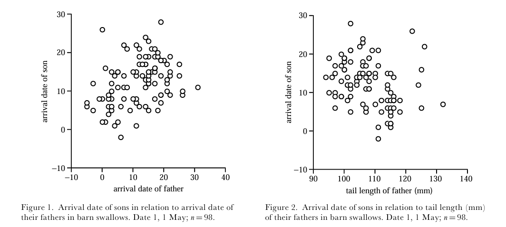
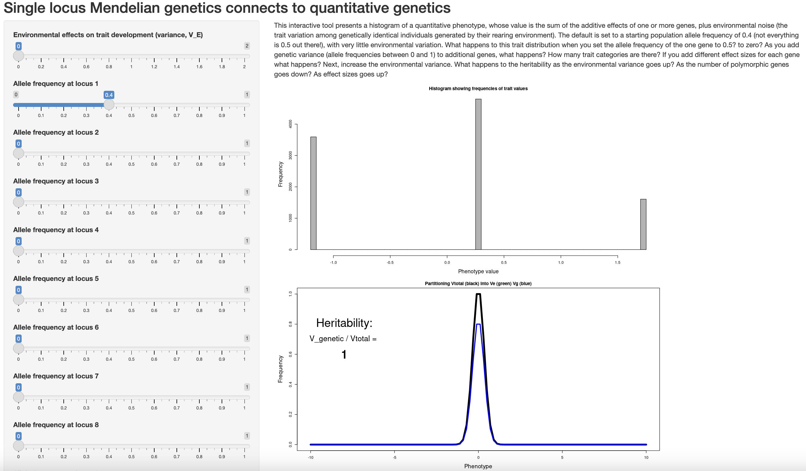

# Quantitative Genetics 

The majority of this class focuses on theory and data relative to one or two loci. In some cases (such as plumage polymorphisms in birds), a single locus is responsible for all phenotypic variation present in a population. However, many traits we are interested in are *quantitative*, i.e. vary continuously, not categorically. (Human height is perhaps the most obvious example.) This observation suggests they are influenced by many genes of small effect (are *polygenic*).  To study quantitative traits, we will need some introduction to the quantitative genetics, a body of work that developed in parallel to population genetics in the 20th century. Quantitative genetics is distinctive in treating the genetic variants responsible for phenotypes as essentially unknown and unobservable, something that has only recently begun to change with massive genomic datasets over hundreds of individuals. Perhaps the most important concept in the field is that of heritability. 

We define heritability as the proportion of total phenotypic variance ($P_V$) that is attributable to genetic variation, meaning variation that parents can pass on to offspring. We denote it $h^2=\frac{V_A}{V_P}$—importantly, the "exponent" is not actually an exponent, but simply a convention of the field. Heritability is important because phenotypic variation also includes environmental influences:

$$
\text{Phenotype = Genotype + Environment}
$$

What is environmental influence? Height, for example, has a clear genetic basis. But it is also determined by nutrition during childhood—a non-genetic contribution of the environment a particular genotype finds itself in (and the resources available to it).  

An important concept for estimating heritability is the definition of variance, or spread of data around the mean, which we borrow from statistics: 

$$
V_{P} = \frac{\sum_{i=1}^{n} (P_{i} - \bar{P})^2}{n - 1}
$$

where ${P_i}$ is an individual's phenotypic value, $\bar{P}$ is the mean phenotypic value for the sample, and $n$ is the sample size. 

The standard deviation of a phenotype (also a measure of the spread around the mean) is the square root of its variance: 

$$
\sigma_{P}= \sqrt{V_{P}}
$$

The covariance between offspring & parents is the sum of the products of the difference between individual values and the population (meaning all parents or all offspring) mean: 

$$
COV_{PO} = \frac{\sum_{i=1}^{n} (P_{i} - \bar{P})(O_{i} - \bar{O})}{n - 1}
$$

Building off this, the correlation between trait values for parents and offspring is: 

$$
r_{PO} = \frac{COV_{PO}}{\sqrt{(V_P*V_O)}}
$$

where $V_P$ is parental trait variance and $V_O$ is offspring trait variance.  

Heritability ($h^2$) can be directly estimated as the slope of a regression of offspring on average parent trait values, which is simply the covariance of parent and offspring trait values over total phenotypic variance ($\frac{COV_{PO}}{V_P}$). 

To make these concepts more concrete, consider the following data:

| Average Parent Height (cm) | Child Height (cm)  | 
| ---------------------------|:------------------:|
|       160                  |      163           | 
|       170                  |      169           | 
|       164                  |      162           | 
|       180                  |      171           | 
|       161                  |      173           | 

We first calculate $V_{P}$ for the parents using a mean ($\bar{P}$) of $(160+170+164+180+161)/5=167$:  

$$
V_{P} = \frac{\sum_{i=1}^{n} (P_{i} - \bar{P})^2}{n - 1} 
$$
$$
V_{P} = \frac{(160-167)^2+(170-167)^2+(164-167)^2+(180-167)^2+(161-167)^2}{5 - 1} = 68\text{ cm}
$$
This gives us a standard deviation ($\sigma_{po}$) of $\sqrt{68}=8.24$. 

Following the same procedure, we calculate variance in offspring phenotypes, which requires mean offspring height ($\bar{O}$ = (163+169+162+171+173)/5=167.6):  :

$$
V_{O} = \frac{\sum_{i=1}^{n} (O_{i} - \bar{O})^2}{n - 1} 
$$
$$
V_{O} = \frac{(163-167.6)^2+(169-167.6)^2+(162-167.6)^2+(171-167.6)^2+(173-167.6)^2}{5 - 1} 
$$
$$
V_{O} = 23.8\text{ cm}
$$
Next, we calculate the covariance between parent and offspring phenotypes: 

$$
COV_{PO} = \frac{\sum_{i=1}^{n} (P_{i} - \bar{P})(O_{i} - \bar{O})}{n - 1}
$$
$$
\begin{aligned}
 = \frac{(160-167)(163-167.6)+...+(161-167)(173-167.6)}{5 - 1} = 16.25 \text{ cm}
\end{aligned} 
$$
(Here $"..."$ simply indicates the other values of $P_i$ and $O_i$ that don't fit on the page.)

With $COV_{PO}$ we can calculate $r_{PO}$:

$$
r_{PO} = \frac{COV_{PO}}{\sqrt{(V_P*V_O)}} = \frac{16.25}{\sqrt{(68 * 23.8)}} = 0.403934
$$

...and heritability: 

$$
h^2 = \frac{COV_{PO}}{V_P} = \frac{16.25}{68} = 0.2389706
$$
This is exactly the same as the slope of a linear regression of offspring on parent height values:

```{r, warning=FALSE, message=FALSE}
library(tidyverse)
p_i <- c(160, 170, 164, 180, 161)
o_i <- c(163, 169, 162, 171, 173)
df <- cbind(p_i, o_i) %>% as.data.frame()
model <- lm(o_i ~ p_i) 
model$coefficients[2]
```

(Beyond quantitative genetics, the slope of *any* regression can be calculated as $\text{Cov(x, y)}/\text{Var(x)}$).

Though not particularly impressive with so few data, the relationship is obvious when plotted: 

```{r, warning=FALSE, message=FALSE}
ggplot(df, aes(x=p_i, y=o_i)) +
  theme_classic() +
  geom_point(pch=21, size=3) +
  xlim(155, 185) +
  ylim(155, 185) +
  geom_smooth(method='lm', se = FALSE, linetype="dashed", color="red") +
  xlab("Parent Height (cm)") +
  ylab("Offspring Height (cm)")
```

We can now also define total phenotypic variance (which we will also call $V_P$, sorry) as:  

$$
V_P = V_G + V_E + 2COV_{GE}
$$

where $V_G$ is phenotypic genetic variance, or the proportion of phenotypic variance that is rooted in heritable genetic variation; $V_E$ is phenotypic environmental variance, and $2COV_{GE}$ is the covariance between genetics and the environment, which is negligible when individuals are under the same environmental conditions. 

We can further partition $V_G$ into effects from **additive**, **dominant**, or **partially dominant** loci: 

$$
V_G = V_A + V_D + V_{PD}
$$

To determine which locus exhibits which mode of inheritance, we look at the relationship between genotypes and quantitative trait values. 

First, we assign genotypes different values, which we represent algebraically with the letters $a$ and $d$: 

genotypes: $AA$, $Aa$, $aa$  
genotypic values: $+a$, $d$, $-a$     

In other words, $+a$ is the deviation of the trait value for $AA$ away from the mean of the two homozygotes, $d$ is the deviation of the trait value for the heterozygote away from the mean of the two homozygotes, and $-a$ is deviation of the trait value for $aa$ away from the mean of the two homozygotes. (You can thus think of the "mean" trait value of the two homozygotes as 0, as $(+a + -a)/2 =0$) Homozygotes differ in genotypic value by $2a$, and heterozgotes differ from the mean of the two heterozygotes (again, 0) by $d$. 

Different relationships between genotypes and genotypic values result from different modes of inheritance. In **additive genetic variance**, each allele contributes equally to the value of a phenotype, and the heterozygote's trait values are the average of the two homozygotes ($+a = 2; -a = 2;  d = 0$). 

```{r, echo=FALSE}
library(ggplot2)

df <- data.frame(tarsus_length=c(7, 5, 3),
                 genotype=c("AA", "Aa", "aa"))

ggplot(data=df, aes(x=genotype, y=tarsus_length, group=1)) +
  theme_classic() +
  geom_line()+
  geom_point() +
  ylab("Trait Value") +
  xlab("Genotype") +
  geom_label(label = df$tarsus_length)

```

In contast, under **dominant genetic variance**, one copy of an allele is sufficient to attain the maximum value of a phenotype ($d = +a = 2$)  

```{r, echo=FALSE}
library(ggplot2)

df <- data.frame(tarsus_length=c(7, 7, 3),
                 genotype=c("AA", "Aa", "aa"))

ggplot(data=df, aes(x=genotype, y=tarsus_length, group=1)) +
  theme_classic() +
  geom_line()+
  geom_point() +
  ylab("Trait Value") +
  xlab("Genotype") +
  geom_label(label = df$tarsus_length)

```

With **partially dominant genetic variance** one copy of an allele is not sufficient to attain the maximum value of a phenotype, but the genotypic value of the heterozygote is greater than the average value of the two homozygotes ($+a = 2; -a = 2;  d = 1.3$)

```{r, echo=FALSE}
library(ggplot2)

df <- data.frame(tarsus_length=c(7, 6.3, 3),
                 genotype=c("AA", "Aa", "aa"))

ggplot(data=df, aes(x=genotype, y=tarsus_length, group=1)) +
  theme_classic() +
  geom_line()+
  geom_point() +
  ylab("Trait Value") +
  xlab("Genotype") +
  geom_label(label = df$tarsus_length)

```

As a shortcut, you can find $a$ by dividing the difference between the trait values of the two homozygotes  by 2:  

$$
a = \frac{(\text{AA value - aa value})}{2} = \frac{(7-3)}{2} = 2
$$

You can find $d$ by first finding the midpoint (arithmetic mean) of the two homozygote trait values, and then subtracting that from the heterozygote trait value: 

$$
\text{midpoint} = \frac{\text{(AA value + aa value)}}{2} = \frac{(7+3)}{2} = 5
$$
$$
d = 6.3 - 5 = 1.3
$$

::: {.callout-note title="Heritability of Migration Timing in Barn Swallows"}

Barn Swallows (*Hirundo rustica*) are cosmopolitan songbirds that are migratory across the majority of their range. An important migratory phenotype is *arrival date*, which is (unsurprisingly) simply the date a given individual arrives on breeding grounds. Because this has impacts on resource and mating partner availability, it is potentially under strong natural selection. Because arrival date varies continuously, studying any genetic basis it might have requires tools from quantitative genetics. Anders Møller (@pape2001heritability) used field data on the arrival date of 98 father / son pairs of barn swallows to estimate heritability with the regression approach described above. This deceptively simple method revealed $h^2=0.536$. This heritability was comparable to that of tail length, and indicates the trait may respond to selection. 

  


:::

::: {.callout-note title="Quant Gen App"}
Dan Bolnick [has another app](https://bolnicklab.shinyapps.io/MultilocusQuantGen/) that helps connect this material to Mendelian single locus genetics. 



Open the app in your browser and consider the questions: 

1) One by one, change the allele frequencies of additional loci to intermediate values (i.e., not 0 or 1). What happens to estimates of heritability and the distribution of phenotypes? 

2) Boost the environmental effect on trait variance slider. How do heritability and the distribution of phenotypes change? 

:::


