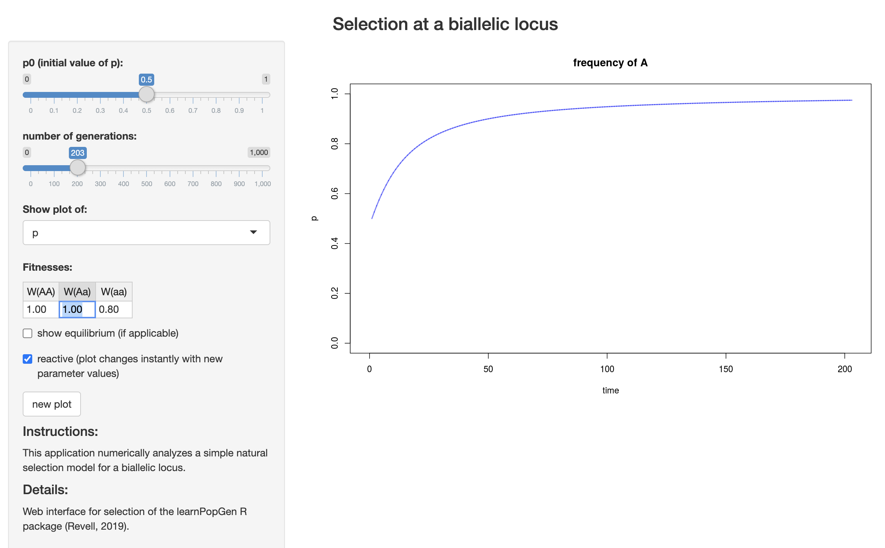

# Natural selection

The expected genotype frequencies for a diallelic locus under Hardy-Weinberg Proportions assumes random mating, infinite population sizes, no mutation, no migration, and no natural selection. The next section of the class will focus on developing our understanding of how genotype and allele frequencies change across generations when each of these assumptions is violated (both independently and in some cases, jointly). We will begin with the last assumption on our list: natural selection. As population and conservation genetics are at their core the study of the most fundamental type of microevolutionary change, it is appropriate to begin with the most famous evolutionary mechanism---environmental factors that lead to differential survival and reproduction across genotypes.

We will now develop a single locus model for allele frequency changes in response to natural selection. Let's begin with an extreme example—a lethal recessive disease. The following table lays out phenotypes, genotypes, and frequencies under HWP. It also details relative fitness (in which the most-fit genotype is 1, and others are scaled proportionally.)

|                       |                     |                     |         |           |
|:----------------|:-------------|:-------------|:-------------|:-------------|
| phenotype             | normal              | normal              | dead    | total     |
| genotype              | AA                  | Aa                  | aa      | 1         |
| relative fitness      | 1                   | 1                   | 0       | 1         |
| freqs                 | $p^2$               | $2pq$               | $q^2$   | 1         |
| freqs after selection | $p^2*1$             | $2pq*1$             | $q^2*0$ | $1 - q^2$ |
| adjusted freqs        | $\frac{p^2}{1-q^2}$ | $\frac{2pq}{1-q^2}$ | $0$     | 1         |

The frequency of the recessive allele ($q$) in the next generation is therefore the number recessive homozygotes (now 0) + 1/2 the number of heterozygotes divided by the total number of individuals minus the recessive homozgygotes that perished:

$$
\frac{0 + pq}{1 - q^2} = \frac{q(1 - q)}{(1 - q)(1 + q)} = \frac{q}{1 + q}
$$ (Note that since $p + q = 1$, $p = 1-q$).

The change in the frequency of $q$ ($\Delta q$) will be the difference between the new frequency of $q$ ($q_1$) and and its initial frequency ($q$):

$$
\Delta q = q_1 - q = \frac{q}{1 + q} - q = \frac{q}{1 + q} - \frac{q(1 + q)}{1 + q} = \frac{q - q(1 +q)}{1 + q} = \frac{q - q - q^2}{1 + q} = \frac{-q^2}{1 + q}
$$

We can expand this model for nonlethal cases where homozygous recessive genotypes have lower relative fitness by a quantity $s$, which w will refer to as the *selection coefficient*:

|                       |                      |                      |                               |            |
|:----------------|:-------------|:-------------|:-------------|:-------------|
| phenotype             | normal               | normal               | sickly                        | total      |
| genotype              | AA                   | Aa                   | aa                            | 1          |
| relative fitness      | 1                    | 1                    | 1 - $s$                       | 1          |
| freqs                 | $p^2$                | $2pq$                | $q^2$                         | 1          |
| freqs after selection | $p^2*1$              | $2pq*1$              | $q^2*(1 - s) = q^2 - sq^2$    | $1 - sq^2$ |
| adjusted freqs        | $\frac{p^2}{1-sq^2}$ | $\frac{2pq}{1-sq^2}$ | $\frac{q^2 - sq^2}{1 - sq^2}$ | 1          |

What, then, will happen to the frequency of allele $p$ given a $q$ has a fitness of $1 - s$? We know that its frequency in the next generation will be the adjusted frequency of homozygotes plus 1/2 the adjusted frequency of heterozygotes:

$$
p_1 = \frac{p^2}{1 - sq^2} + \frac{1}{2}(\frac{2pq}{1 - sq^2}) = \frac{p^2 + pq}{1 - sq^2} = \frac{p(p + q)}{1 - sq^2} = \frac{p}{1 - sq^2}
$$ This gives us $p_1$, or the frequency of $p$ in the next generation. (Note again that one step above involves substituting $p+q$ for $1$.) The change ($\Delta$) in $p$ between generations is simply $\Delta p = p_1 - p$:

$$
\Delta p = \frac{p}{1 - sq^2} - p = \frac{p}{1 - sq^2} - \frac{p(1 - sq^2)}{1 - sq^2} 
$$ $$
\Delta p = \frac{p - p(1 - sq^2)}{1 - sq^2} = \frac{p - p + spq^2}{1 - sq^2} = \frac{spq^2}{1 - sq^2}
$$ This tells us three things: that $p$ will increase in frequency, and that its degree of increase depends on the initial frequency of $q$ and the value of the selection coefficient, $s$.

The last case we will address is partial dominance, which we will model with the addition of a dominance coefficient, $h$. (Under complete dominance, $h$ = 0; under additive inheritence, $h$ = 0.5.)

|                       |                                |                                |                                       |                    |
|:----------------|:-------------|:-------------|:-------------|:-------------|
| phenotype             | normal                         | normal                         | sickly                                | total              |
| genotype              | AA                             | Aa                             | aa                                    | 1                  |
| relative fitness      | 1                              | 1 - $hs$                       | 1 - $s$                               | 1                  |
| freqs                 | $p^2$                          | $2pq$                          | $q^2$                                 | 1                  |
| freqs after selection | $p^2$                          | $2pq(1 - hs) = 2pq - 2hspq$    | $q^2(1 - s) = q^2 - sq^2$             | $1 - 2hspq - sq^2$ |
| adjusted freqs        | $\frac{p^2}{1 - 2hspq - sq^2}$ | $\frac{2pq}{1 - 2hspq - sq^2}$ | $\frac{q^2 - sq^2}{1 - 2hspq - sq^2}$ | 1                  |

Turning this into an expression for $\Delta p$ is a little gnarly:

$$
\Delta p = p_1 - p = \frac{p^2}{1 - 2hspq - sq^2} + \frac{1}{2}\frac{2pq - 2hspq}{1 - 2hspq - sq^2} - p 
$$ $$
\Delta p = \frac{p^2 + pq - hspq}{1 - 2hspq - sq^2} - p\\
$$ $$
\Delta p = \frac{p^2 + pq - hspq}{1 - 2hspq - sq^2} - \frac{p(1 - 2hspq - sq^2)}{1 - 2hspq - sq^2} = \frac{(p^2 + pq - hspq) - p(1 - 2hspq - sq^2)}{1 - 2hspq - sq^2}\\
$$ $$
\Delta p = \frac{p((p + q - hsq) - (1 - 2hspq - sq^2))}{1 - 2hspq - sq^2}
$$

Once again substituting 1 for $p + q$:

$$
\Delta p = \frac{p(1 - hsq - 1 - 2hspq - sq^2)}{1 - 2hspq - sq^2} 
$$ $$
\Delta p = \frac{p(- hsq + 2hspq - sq^2)}{1 - 2hspq - sq^2} = \frac{p((2pq-q)hs + sq^2)}{1 - 2hspq - sq^2} = \frac{spq((2p-1)h + q)}{1 - 2hspq - sq^2}
$$ Because $2p -1 = p + p -1$ and $p = 1 - q$, $2p -1 = p + 1 - q -1 = p - q$:

$$
\Delta p = \frac{spq((p - q)h + q)}{1 - 2hspq - sq^2}
$$

That's about as good as we can get it!

## Summary

As the math in the course becomes more complicated, it can be easy to get lost in the weeds. The big takeaway here is that deterministic models of selection show that homozygous genotypes with low fitness relative to the homozygote for the alternate allele (not necessarily recessive!) will decrease in frequency in the population, reducing the frequency of the allele they are homozygous for in turn. The change in frequency is determined by the frequency of the focal allele ($q$) in the present generation and the strength of selection (**s**); in anything less than complete dominance, the largest single-generation shifts are possible when alternate alleles are at intermediate frequencies and $s$ is close to 1. I repeat our important derivations:

1)  The frequency of a recessive lethal allele in the next generation under complete dominance;

$$
q_1=\frac{q}{1 + q}
$$

2)  The *change* in frequency of a recessive lethal allele and the alternate allele under complete dominance;

$$
\Delta p = \frac{q^2}{1 + q}; \text{  } \Delta q = \frac{-q^2}{1 + q}
$$

3)  Alelle frequency changes under complete dominance and selection against $q$; and

$$
\Delta p = \frac{spq^2}{1 - sq^2}; \text{  } \Delta q = \frac{-spq^2}{1 - sq^2}
$$ 4) Alelle frequency changes under partial dominance and selection against $q$:

$$
\Delta p = \frac{spq((p - q)h + q)}{1 - 2hspq - sq^2}; \text{  } \Delta q = \frac{-spq((p - q)h + q)}{1 - 2hspq - sq^2}
$$

These models let us predict allele frequency changes under scenarios where selection is the only evolutionary force acting on a given population. For example, consider the mice studied by Nachman et al. (@nachman2003genetic) Coat color appears to show complete dominance: Individuals with the genotypes $DD$ and $Dd$ at Mc1r are dark, while those with the genotype $dd$ are light. If $f(D)=0.3$ and $f(d)=0.7$, and the relative fitness of white mice on lava rocks is 0.3 ($W(dd)=0.3$, which means a selection coefficient of $s=1-0.3=0.7$), how much will allele frequencies in that habitat change in one generation? We can solve for this with simple substitution:

$$
\Delta p = \frac{spq^2}{1 - sq^2}; \text{  } \Delta q = \frac{-spq^2}{1 - sq^2}
$$ $$
\Delta p = \frac{0.7*0.3*0.7^2}{1 - 0.7*0.7^2}; \text{  } \Delta q = \frac{-0.7*0.3*0.7^2}{1 - 0.7*0.7^2}
$$ $$
\Delta p = 0.1566; \text{  } \Delta q = -0.1566
$$

::: {.callout-note title="Selection on Armor in Sticklebacks"}
Freshwater threespine stickleback (*Gasterosteus aculeatus*) on the coast of British Columbia are derived from heavily-armored marine ancestors, but have repeatedly evolved a reduced number of lateral plates. Hypothesizing this transition was due to developmental advantages associated with avoiding investment in plate development, Rowan Barrett and colleagues (@barrett2008natural) transplanted marine sticklebacks to freshwater ponds and tracked the frequency of an allele associated with fewer lateral plates through time. They observed increases in multiple replicate populations, indicating selection consist with their growth advantage hypothesis (though oscillations in the fitness of genotypes throughout each fish's life cycle suggest the story is more complicated).

:::

::: {.callout-note title="Selection App"}
Liam Revell has an app to analytically solve for allele frequencies under different selection and dominance coefficients: https://phytools.shinyapps.io/selection/

Open the app in your browser and work through the following questions.

1)  Set fitnesses to $WW(AA)=1.0$, $W(Aa)=1.0$, and $W(aa)=0.8$. Set $p0$ to $0.01$, and make sure you are showing a plot of $p$. What mode of inheritance is occuring at this locus? What is the value of the selection coefficient? How many generations does it take to reach $p=0.6$?

2)  Change $W(Aa)$ to $0.9$. What mode of inheritance are you modeling now? Does the time it take to reach $p=0.6$ change?

3)  Switch to showing a plot of q without changing any other settings. What can you conclude about the relationship between $p$ and $q$ through time?

4)  Develop a question and address it using this app. Be prepared to report back to the class.
:::
