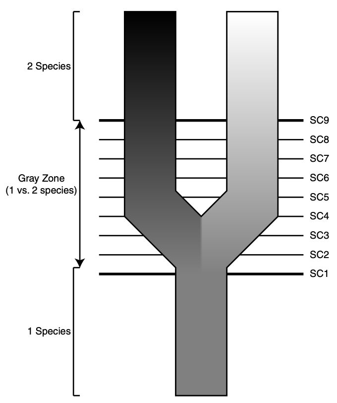
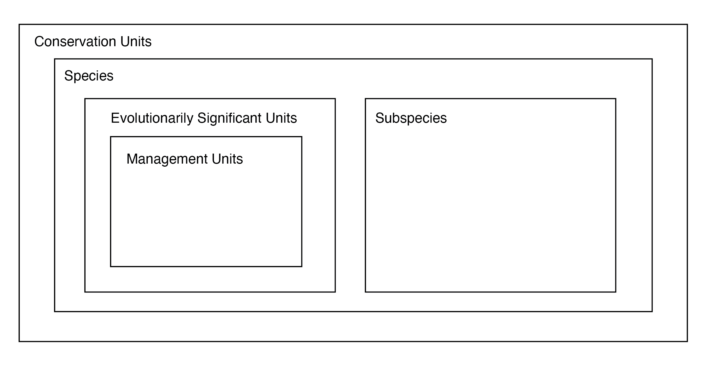
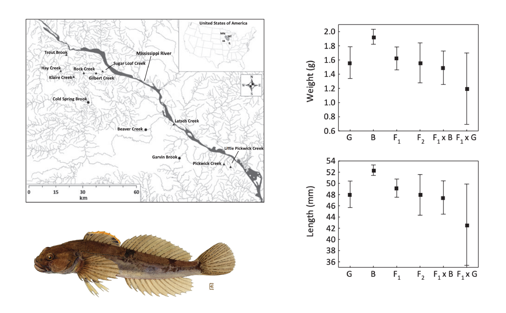

# Taxonomy, Systematics, and Management Units

Conservation genetics encompasses the use of genetic tools to better understand the taxonomy and systematics of threatened species and populations. By some definitions, it may be the topic area that produces the single greatest number of scientific articles in the field. For example, in a recent review of conservation genetics papers aimed at describing global disparities in sequence effort and technology (@linck2024latitudinal), Daniel Cadena and I categorized 394 papers in leading conservation genetics journals by (crude) topic area. Of these, 28 (\~7%) were in the category that explicitly included taxonomy and systematics. However, the category that included defining population genetic structure---a task at the core of identifying conservation units, and anecdotally the single most common one in conservation genetics papers---had a whopping 330 (83%) of the remaining studies. It would therefore be malpractice for me not to touch on the conceptual basis of this work in passing.

To start, some definitions are in order. Per the Convention on Biological Diversity, Taxonomy is "the science of naming, describing and classifying organisms and includes all plants, animals and microorganisms of the world". Systematics is often used interchangeably with taxonomy, but adds an evolutionary dimension: what are the *relationships* among taxonomic units?

So why does taxonomy matter for conservation? There are four key reasons:

1.  Unrecognized endangered species may be allowed to go extinct;
2.  Endangered species may be denied protection if considered a population of a common species;
3.  Incorrectly diagnosed species may be hybridized with other species, potentially reducing fitness;
4.  Populations that could be used to ameliorate inbreeding might be overlooked.

All four of these points circle around the need to define the basic units of biodiversity. Familiarity with **species concepts** is important to this goal. Species concepts are famously abundant, with and counting at the time of a review in the mid-90s (@mayden1997hierarchy). Part of the reason for their proliferation is widespread confusion between conceptual basis and operational criteria (*definitions* versus *delimitation*). For anyone who is not a professional systematist or philospher of science, most will appear redundant or irrelevant. The box below defines six broad categories of species concepts; the **biological species concept**, **genotypic cluster species concept** and **phylogenetic species concept** are most relevant to modern conservation genetics.

::: {.callout-note title="Species Concept Categories"}
-   **Biological species concept**: A species is a group of actively or potentially interbeeding individuals separated from other such groups by intrinsic or extrinsic reproductive isolation (not only geography)

-   **Ecological species concept**: A species is a group of individuals that share the same ecological niche or adaptive zone.

-   **Evolutionary species concept**: A species is a group of individuals with the same evolutionary role, tendencies, and historical fate.

-   **Phylogenetic species concept**: A species is a group of individuals that conform to one or more phylogenetic criteria (reciprocal monophyly, coalescence of all gene trees).

-   **Phenetic cluster species concept**: A species is a group of individuals that form a cluster in morphological space separated from other such groups (similar trait values for multiple features).

-   **Genotypic cluster species concept**: A species is a group of individuals that form a cluster in genoptypic space separated from other such groups (similar allele frequencies at multiple loci).\
:::

For any given situation—--say, a group of partially intergrading populations with uncertain limits and relationships---multiple studies will frequently arrive at conflicting conclusions about the number and identify of species, genetic demes, and / or conservation units. Methological sources of this conflict include the application of alternate species definitions, insufficient data, or varied sampling schemes. A common *biological* reason for ambiguity is that speciation is a continuum, and any two lineages diverging from a shared common ancestor may be at a different point on trajectories ending in complete reproductive isolation and valid biological species. As a result, some understanding of speciation as a process is useful for our goals.

In vertebrates, at least, speciation typically proceeds in **allopatry**, i.e. between geographically isolated populations. Rarely in vertebrates---though theoretically possible---does speciation proceeed in **sympatry** (populations with overlapping distributions) or *parapatry* (populations with non-overlapping but adjacent distributions). More important than geography *per se* are its impacts on gene flow. In its pure form---think flightless birds on different oceanic islands---allopatric speciation occurs when the migration rate between diverging subpopulations is $m=0$. Sympatric speciation occurs when $m=0.5$, i.e. the probability of receiving an allele from a member of the other, diverging lineage is equivalent to the probability of receiving one from a conseecific. Parapatric speciation occurs between these extremes: in other words, when $0<m<0.5$.

The current consensus is that most speciation events, regardless of geography or migration rate, are driven by natural selection, not drift. However, in some lineages---particularly plants———speciation can occur almost instantly with changes in ploidy (the number of chromosomes), even if those changes are not immediately adaptive. Nonetheless, the process can take a long time in many contexts, mediated by changes in gene flow, selection, and other factors that can halt or reverse divergence. It is thus reasonable to conclude that for some nontrivial number of edge cases, disagreements about what individuals consistute what population or species have no hard answer. Here, values and politics will be more useful than hard science.

The process of identifying the boundaries of species and assigning individuals to groups is known as **species delimitation**. Species delimitation requires *operational criteria* (which may or may not be independent from species concepts): How do we separate one species from another in practice? In the past, this work was delegated to taxonomic experts, who made often-subjective judgement calls about the significance of particular phenotypic characters, and assessed individuals and populations against their standards. This work gradually became more quantitative, requiring algorithims to assess phenotypic or genetic differences between populations.

The past two decades have seen the ongoing synthesis of phylogenetics and systematics, and populations and species are now routinely demarcated using methods that simultaneously infer evolutionary relationships among genetic demes using statistical models of DNA sequence evolution. This work builds off an earlier tradition of quantifying molecular divergence with statistics such as Nei's Genetic Distance ($D_N$):

$$
D_{N} = -ln(\frac{\sum_{i=1}^m(p_{ix}p_{iy})}{\sqrt{(\sum_{i=1}^mp_{ix}^2)(\sum_{i=1}^mp_{iy}^2)}}) 
$$

Nei's Genetic Distance has the useful property that if the substitution rate is constant per generation, $D_{N}$ will increase proportionally to divergence time (not true of $F_{ST}$, for example). As a result, when $p_{ix} = p_{iy}$, $D_N$ = 0; when no alleles shared, $D_N$ = $\infty$. Assuming mutation rates across markers are equal, and that they cannot occur at same locus twice, $D_N$ should faithfully summarize evolutionary divergence in a way that can be compared to benchmarks for particular taxa.

::: {.callout-note title="The Metapopulation Lineage Species Concept"}
A paper that has come as close to ending species concept debates as anyone is ever likely is Kevin De Quieroz's 2007 *Systematic Biology* article entitled "Species Concepts and Species Delimitation". De Queiroz argues convincingly that nearly all evolutionary species concepts agree that a species should be considered a lineage of metapopulations, and that (as I echo above) disagreement stems from the fact that various operational criteria only apply at different time points in the speciation continuum.

{width="50%"}
:::

## Management Units

Species delimitation is also important because conservation law requires categories to which to apply. The US Endangered Species Act permits listing of "any subspecies of fish or wildlife or plants, and any distinct population segment of any species of vertebrate fish or wildlife which interbeeds when mature". Unfortunately, the ESA does not define DPS, but FWS offers guidance: "a population segment’s DPS status is determined by the *discreetness* and *significance* of the population segment compared with the species as a whole".

Grizzlies in the Greater Yellowstone Ecosystem (GYE) are a prime example of the difficulty of applying the ESA. In 2007, the US Fish & Wildlife Service (USFWS) decided bears in the region constituted a valid DPS that had sufficiently recovered from mid-20th century lows, delisting them as a result. Two years later, the US District Court for District of Montana determined USFWS had not adequately considered Whitebark Pine (*Pinus albicaulis*) decline in their decision, leading to relisting of the DPS. In 2017, USFWS declares that their research had indicated Whitebark Pine decline was *not* an existential threat to the DPS, again delisting it. The same year, the Crow Indian Tribe responded with a lawsuit to relist on the basis of species-wide popualtion trends. This argument, though successful, muddied the waters about what was actually on the table for legal protection, as the basis for listing GYE grizzlies in the first place was their demographic (and perhaps evolutionary) independence.

DPS are a special case---in this case, a legal designation within a certain jurisdiction---of the idea that there are often important targets of conservation below the species level, which should reflect distinct population-level attributes. In an influential 1994 paper, Craig Moritz (@moritz1994defining) introduced the idea of evolutionarily significant units, more or less equivalent to intraspecific lineages and identifiable with phylogeographic methods. More generally, conservation units attempt to preserve demographic independence, locally adapted populations, and other forms of phenotypic and genetic variation (@funk2012harnessing).

::: {.callout-note title="Subspecies Delimitation in California Gnatcatchers (*Polioptila californica*)"}
Because identification of conservation units can determine the political status---and ultimate survival---of specific populations of organisms, scientific debates over their distinctiveness or validity can become heated. One example of this can be found in a series of papers (@zink2013phylogeography, @mccormack2015interpreting, @zink2016geographic) over the validity of two subspecies of the California Gnatcatcher. In the exchange, Bob Zink and colleagues suggest named subspecies have no validity as ESUs, pointing to phylogenetic trees with poor statistical support and geographic incoherence. John McCormack and colleagues respond that their conclusion---which may permit development in coastal chapparal---was an artifact of using genetic markers with poor resolution.

{width="50%"}
:::

## Outbreeding Depression

A consequence of poor species delimitation and taxonomy is that managers may inadvertently generate **outbreeding depression** when translocating or crossing individuals from unexpectedly divergent lineages. Outbreeding depression may be caused for two primary reasons: The fact that populations may be adapted to **different environmental conditions**, and that they may have evolved **different coadapted gene complexes (positive epistasis)**. The former concern is more broadly applicable, as local adaptation is pervasive and poorly known in most wild species. But cryptic species level diversity is surprisingly widespread, particularly in non-vertebrates and subtropical and tropical lineages. Last-ditch conservation breeding therefore runs a risk of generating hybrids, not pure descendants.

::: {.callout-note title="Outbreeding Depression in Slimy Scuplin"}
Fish are frequently the target of reintroduction programs that rely on individuals from different sources. When these sources are geographically isolated—--as is often the case for freshwater species---outbreeding depression can result. In Minnesota, Huff and colleagues (@huff2011mixed) examined the consequences of mixing of different parental stock on fitness trates. They found pure populations were notably larger in length weight, body condition, and persistence, something they attribute to disrupted coadpated gene complexes.

:::
