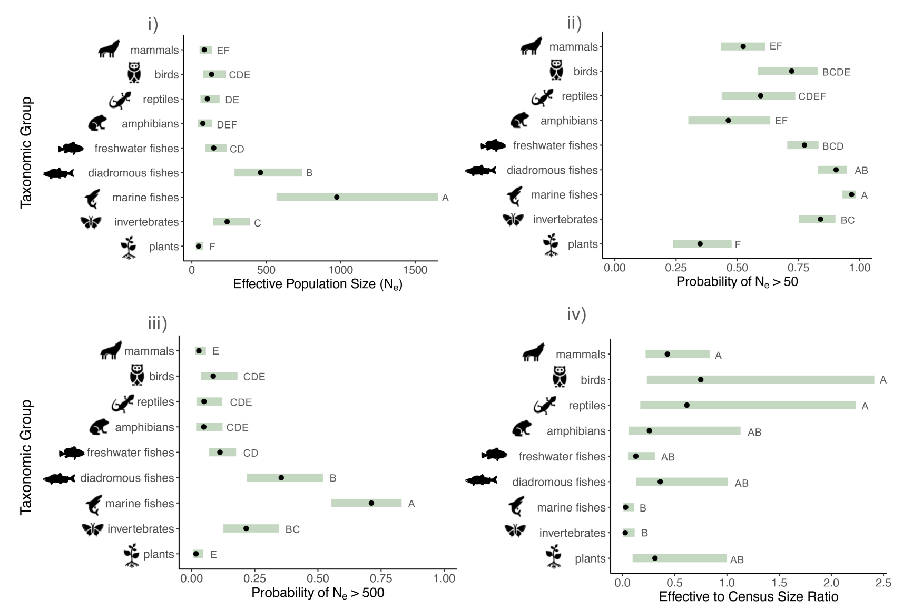

### Genetic Viability  

A fundamental question in conservation genetics is how big a population has to be to maintain viability into the future. The Australian geneticist I.R. Franklin took an early but influential stab at addressing it with his 50/500 Rule, which posits $N_e=50$ is required to avoid significant fitness loss due to inbreeding depression in the short term (~5 generations), while $N_e=500$ is required to maintain long-term evolutionary potential.

His derivation of $N_e=50$ was fairly simple. Evidence from animal breeders suggested that keeping $F$ below 0.05 would be sufficient to avoid impactful inbreeding depression. Franklin then solved for $N_e$ using the equation relating inbreeding depression to population size and number of generations: 

$$
F = 1 - (1 - \frac{1}{2N_e})^t
$$
$$
0.05 = 1 - (1 - \frac{1}{2N_e})^{5}
$$
$$
0.95 = (1 - \frac{1}{2N_e})^{5} \sim e^\frac{-5}{2N_e}
$$
$$
ln(0.95) \sim \frac{-5}{2N_e}; \text{  } 2N_e = \frac{-5}{ln(0.95)}
$$
$$
N_e = \frac{-2.5}{ln(0.95)} \sim 49 
$$
(50 was catchier!)

Franklin's derivation of 500 was slightly more complicated. He began with the assumption that to maintain evolutionary potential, the loss of additive genetic variance (the genetic variance most important for responding to selection) must be balanced out by its input by mutation:

$$
\Delta V_A = V_M - (\frac{V_A}{2N_e})
$$
Here, $V_M$ represents the mutation rate, while the second term is the additive variance analog of $\frac{pq}{2N_e}=\sigma^2$ (i.e., the variance in allele frequencies due to drift). At equilibrium, $\Delta V_A=0$, so $V_M=\frac{V_A}{2N_e}$. Therefore: 

$$
2N_eV_M=V_A
$$
$$
2N_e=\frac{V_A}{V_M}
$$
$$
N_e=\frac{V_A}{2V_M}
$$
The required effective population size to maintain $V_A$ therefore depends on the existing additive genetic variance and the rate at which it is replenished: the higher the latter, the lower the necessary $V_M$. At the time of the derivation, the best estimate of a mutation rate for $V_M$ came from *Drosophila* bristles, and was $10^{-3}*V_E$, where $V_E$ is the environmental variance (i.e., mutation adds roughly $\frac{1}{1000}$ the variance the environment does). This estimate gives us the following relationship:

$$
N_e = \frac{V_A}{2*0.001*V_E}=500\frac{V_A}{V_E} 
$$

Next, Franklin took into account heritability ($h^2$), which is equal to the proportion of a phenotype that is due to additive genetic variance. Since phenotype is roughly equivalent the sum of the additive genetic variance that contributes to it and the envionmental variance that contributes to it, $h^2\sim\frac{V_A}{V_A + V_E}$:

$$
\frac{h^2}{1} \sim \frac{V_A}{V_A+V_E}
$$
$$
\frac{h^2}{1-h^2} \sim \frac{V_A}{V_E}
$$

He then substituted this relationship into his previous work, and finally solved for $N_e$ using an estimate of bristle heritability ($h^2=0.5$):

$$
N_e = 500\frac{V_A}{V_E} = 500\frac{h^2}{1-h^2} = 500\frac{0.5}{1-0.5}=500  
$$

Thus—very crudely—an effective population size of 500 is required to maintain long-term evolutionary potential. 

:::{.callout-note title="How many species meet the 50 / 500 rule?"}

Despite its strong assumptions, the 50 / 500 rule sets relatively modest conservation targets. In a 2024 paper, Shannon Clarke and coauthors assembled a dataset of georeferenced $N_e$ estimates from 3,829 populations across diverse taxonomic groups. They found that plant, mammal and amphibian populations had a <54% probability of meeting the $N_e$=50 rule, and a <9% probability of meeting the $N_e$=500 rule; broadly speaking, lower $N_e$ was correlated with a higher human footprint. However, the extent to which low $N_e$ reflects contemporary threatened status---versus long-term patterns due to life history---remains unknown. 

:::

